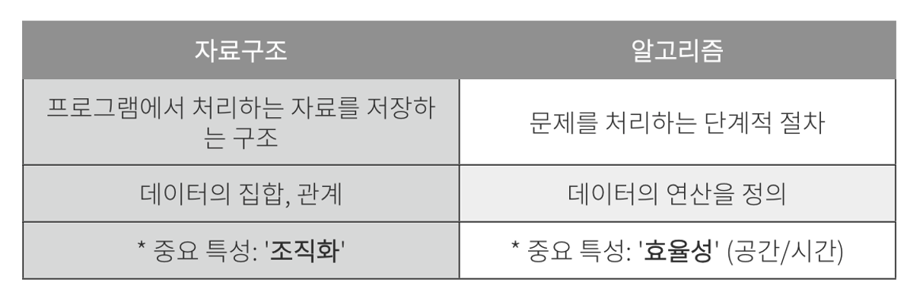

# Program

## Program이란?

: 프로그램이란 **데이터를 표현 (자료구조)** 하고, 그렇게 표현된 **데이터를 처리(알고리즘)** 하는 것이다.

**프로그램 = 자료구조 + 알고리즘**

- 프로그램 = 자료구조 + 알고리즘
  : 예) 최대값 탐색 프로그램 = 배열 + 순차탐색
- 자료구조와 알고리즘은 상호 밀접한 관계 (자료구조에 따른 알고리즘 결정)

