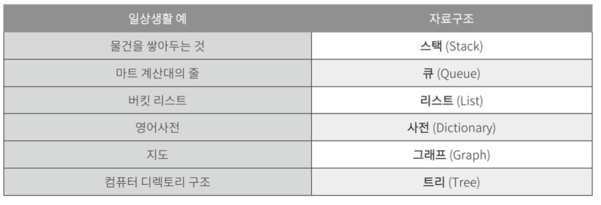
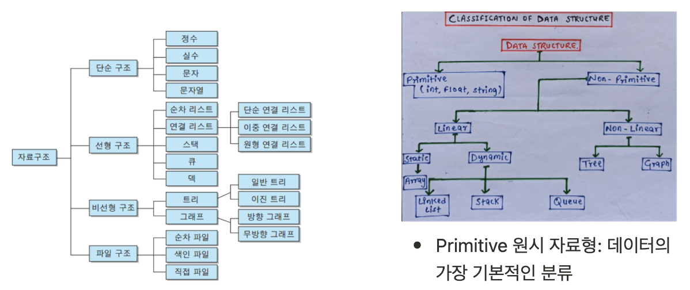

# Data Structure

## Data Structure란?

: 자료구조란 데이터를 **정리**하는 것 ( **organize data** ). 즉 **표현하고 저장하는 방법.**

왜 해? 그건 우리의 코딩의 스피드에 바로 영향을 주거든. 어떤 구조를 쓰느냐에 따라 속도가 달라질 수 있어. 언제 어떻게 쓰는지는 정말 중요해.

### 4 operations

: **search, read, insert, delete.** 즉 검색, 읽기, 삽입, 삭제를 염두 해 두어야 해.

많은 자료구조를 알아 두면, 특정 문제를 해결하는 데에 상황에 가장 적합한 자료구조를 빠르게 찾아 데이터를 정리하고 활용하여 문제를 빠르고 정확하게 해결 할 수 있어.

### 일상생활 vs 자료구조 (비교)

