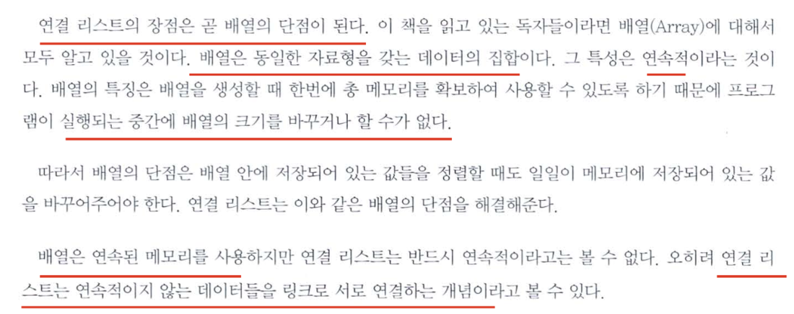

# Linked List

: is a data strcture that represent a sequence of nodes.

## 장점 & 단점

아래 장단점은 C언어에서의 장,단점이라고 이해하면 된다.

파이썬은 기본적으로 리스트 자료형이 링크드리스트의 모든 기능을 지원한다.

1. 장점 -배열은 미리 데이터 공간을 할당해야 하지만 링크드리스트는 미리 할당할 필요가 없다.(유동적으로 데이터 추가,삭제 가능) -링크드리스트 수정시 시간복잡도 O(1)을 갖는다. 항상 일정한 속도
2. 단점 -위 구조에서 보듯이 다음 데이터를 연결하기 위해선 별도의 주소 공간을 가져야 한다.-저장공간 효율이 높지 않음

   -배열은 인덱스를 통해 데이터에 접근하므로 시간복잡도 O(1)을 갖지만 링크드리스트의 경우 O(n)을 갖는다. 즉, 연결 된 정보를 찾기 위해 주소를 확인하고 다음 데이터를 탐색하는 시간이 있기 때문에 접근 속도가 느리다. -중간데이터를 삭제시, 앞뒤 데이터를 연결하고 재구성하는 코드가 추가로 필요하다.



## 1. Singly linked list

**Singly linked list** each node points to the next node in the linked list.


-Node : 데이터와 다음 데이터를 가리키는 주소(포인터)로 이루어져 있다.

-Pointer : 각 노드에서 다음 데이터를 가리키는 주소값을 가진다.

-Head : 링크드리스트에서 가장 시작점인 데이터를 의미한다.

-Tail : 링크드리스트에서 가장 마지막 데이터를 의미

-Next=None(또는 Null) : 다음 데이터가 없을 경우 포인터의 주소값은 None(또는 Null)이다.

### 1) Node 생성

```python
class Node:
    def __init__(self, data=None):  # data만 입력시 next 초기값은 None이다.
        self.data = data        # 다음 데이터 주소 초기값 = None.
        self.next = next        # def __init__(self, data=None, next=None)이라고 써도 된다.


# Node 생성 (data = 1)
node1 = Node(1)

# Node의 값과 포인터 출력하기
print(node1.data)   # 1
print(node1.next)   # None
```

\***\*init\*\*** 메서드는 파이썬에서 클래스로부터 객체를 만들 때 자동으로 호출되는 특별한 메서드야. 이 메서드를 사용하는 이유는 **객체를 초기화하고 필요한 속성을 설정**하기 위해서야.

**객체**는 프로그래밍에서 데이터와 해당 데이터를 처리하는 방법을 포함하는 소프트웨어 개념이야. 객체는 특정한 속성(데이터)과 그 속성을 조작하기 위한 메서드(함수)를 가지고 있어. 이러한 객체는 **클래스(class)**라는 템플릿을 사용해서 만들어지는데, **클래스는 객체를 생성하는데 사용되는 설계 도면**이라고 생각하면 돼.

- **객체(Object)** : 이건 마치 사람이나 자동차와 같은 물건이나 개념을 나타내는 거야. 예를 들어, 우리가 만들고자 하는 자동차 하나를 생각해봐. 그 자동차는 각각의 특징을 가지고 있을 거야. 예를 들어, 색깔이나 브랜드 등이 있겠지.
- **클래스(Class)** : 이건 마치 그림으로 그려진 자동차를 만드는 설계 도면이야. 자동차 클래스는 어떤 자동차가 가져야 할 기본적인 특징과 동작을 정의해. 즉, 자동차의 속성(색깔, 브랜드 등)과 기능(달리기, 멈추기 등)이 클래스에 정의돼.

**간단히 말해서, 클래스는 자동차를 만드는데 필요한 설계 도면이고, 객체는 실제로 만들어진 자동차야.**

#### Example

```python
# 클래스 정의
class 자동차:
    def __init__(self, 색깔, 브랜드):
        self.색깔 = 색깔
        self.브랜드 = 브랜드

    def 달리기(self):
        print("{} 색깔의 {} 자동차가 달립니다!".format(self.색깔, self.브랜드))

# 객체 생성
내_자동차 = 자동차("빨간", "현대")

# 객체의 메서드 호출
내_자동차.달리기()
```

=> 빨간 색깔의 현대 자동차가 달립니다!

이 코드에서:

- **`자동차`** 클래스는 자동차 객체를 만들기 위한 설계 도면입니다. 클래스 안에는 자동차의 색깔과 브랜드를 설정하는 **`__init__`** 메서드와 자동차가 달리는 동작을 나타내는 **`달리기`** 메서드가 정의되어 있습니다.
- **`내_자동차`** 객체는 **`자동차`** 클래스를 사용하여 만들어진 실제 자동차입니다. **`내_자동차`** 객체는 색깔이 "빨간"이고 브랜드가 "현대"인 자동차입니다.
- **`내_자동차.달리기()`** 코드는 **`내_자동차`** 객체의 **`달리기`** 메서드를 호출하여 자동차가 달리는 동작을 수행합니다. 출력 결과는 "빨간 색깔의 현대 자동차가 달립니다!"가 될 것입니다.

### 2) 새로운 Node 연결하기

```python
# Class 정의
class Node:
    def __init__(self, data=None):  # data만 입력시 next 초기값은 None이다.
        self.data = data        # 다음 데이터 주소 초기값 = None.
        self.next = next


# Node 생성 (data = 1)
node1 = Node(1)
node2 = Node(3)

# Node 연결하기
node1.next = node2

# 가장 맨 앞 노드를 head로 지정하기
head = node1

# Node의 값과 포인터 출력하기
print(node1.data)      # 1
print(node1.next.data) # 3
print(node2.data)      # 3
```


```python
class Node:
    def __init__(self, data=None):
        self.data = data
        self.next = None

class LinkedList:
    def __init__(self):
        init = Node('init')
        self.head = init
        self.tail = init

        self.현재노드 = None
        self.데이터수 = 0

    def append(self, data):
        새로운노드 = Node(data)
        self.tail.next = 새로운노드  # init -> 10 -> 20 -> 30 -> 40
        self.tail = 새로운노드       # init -> 10
        self.데이터수 += 1          #  10  -> 20

    def __len__(self):
        return self.데이터수

    def __str__(self):
        현재노드 = self.head
        현재노드 = 현재노드.next
        s =''

        for i in range(self.데이터수):
            s += f'{현재노드.data}, ' # 출력하는 모양
            현재노드 = 현재노드.next
        return f'[{s[:-2]}]'

    def pop(self):# 마지막값 찾음
        마지막값 = self.tail.data
        현재노드 = self.head
        for i in range(self.데이터수):
            if 현재노드.next is self.tail:
                self.tail = 현재노드
                break
            현재노드 = 현재노드.next
        self.데이터수 -= 1
        return 마지막값

    def find(self, data): #값을 찾다가 못찾으면 -1를 반환한다.
        index = -1  # init node가 있기 때문에
        현재노드 = self.head
        for i in range(self.데이터수+1):  #데이터수+1인 이유는 init node가 있으니깐.
            if 현재노드.data == data:
                return index
            index += 1
            현재노드 = 현재노드.next
        return -1

linked_list = LinkedList()
linked_list.append(10)
linked_list.append(20)
linked_list.append(30)
linked_list.append(40)
print(linked_list.head.data)
print(linked_list.head.next.data)
print(linked_list.head.next.next.data)
print(linked_list.tail.data)
print(len(linked_list))
print(linked_list)
print(linked_list.pop())
print(linked_list)
print(linked_list.find(20))
```

init
10
20
40
4
[10, 20, 30, 40]
40
[10, 20, 30]
1


### Example

```python
# Function to initialise the node object
class Node:  # Node 클래스는 연결 리스트의 각 노드를 표현합니다.
    def __init__(self, data): #_init__ 메서드를 통해 노드를 초기화합니다. 각 노드는 데이터 (data)와 다음 노드를 가리키는 포인터 (next)를 가지고 있습니다.
        self.data = data  # # Assign data
        self.next = None  # "next"를 초기화해야 합니다. # Initialize next as null

# Linked List class contains a Node object
class LinkedList: # LinkedList 클래스는 연결 리스트 자체를 나타냅니다.
    def __init__(self):  # __init__ 메서드를 통해 빈 연결 리스트를 초기화합니다. # Function to initialize head
        self.head = None # 처음에는 헤드 노드가 없으므로 self.head는 None으로 설정됩니다.

    def printList(self): # printList 메서드는 연결 리스트의 노드를 순회하며 데이터를 출력합니다. 헤드 노드부터 시작하여 다음 노드로 이동하면서 데이터를 출력하고, 마지막 노드까지 반복합니다.
        temp = self.head
        while temp:
            print(temp.data)
            temp = temp.next

# # Code execution starts here
#  블록은 코드를 실행하는 부분입니다. 이 부분에서 연결 리스트를 생성하고 몇 가지 노드를 추가한 다음 printList 메서드를 호출하여 연결 리스트의 내용을 출력합니다.
if __name__ == '__main__':
    llist = LinkedList()

    llist.head = Node(1)
    second = Node(2)
    third = Node(3)

    llist.head.next = second  # Link first node with second

    '''
	Now next of first Node refers to second. So they
	both are linked.

	llist.head	 second			 third
		|			 |				 |
		|			 |				 |
	+----+------+	 +----+------+	 +----+------+
	| 1 | o-------->| 2 | null |	 | 3 | null |
	+----+------+	 +----+------+	 +----+------+
	'''

    second.next = third  # Link second node with the third node

    '''
	Now next of second Node refers to third. So all three
	nodes are linked.

	llist.head	 second			 third
		|			 |				 |
		|			 |				 |
	+----+------+	 +----+------+	 +----+------+
	| 1 | o-------->| 2 | o-------->| 3 | null |
	+----+------+	 +----+------+	 +----+------+
	'''

    llist.printList()  # 1 2 3
```

## **2. Doubly linked list**

: gives each node pointers to both the next node and the previous node.
