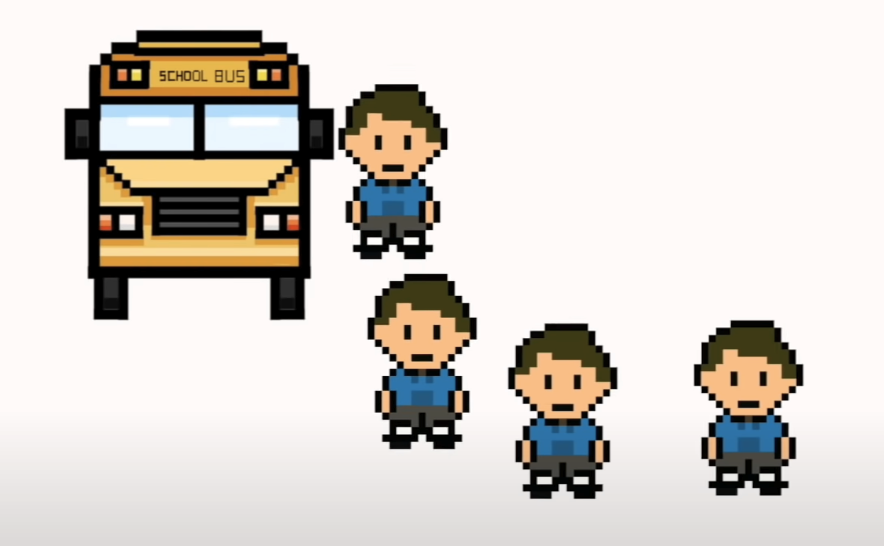
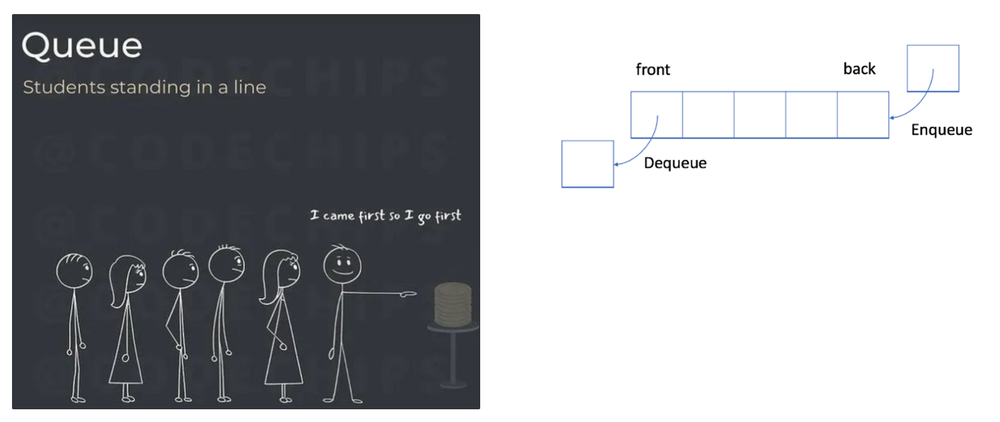
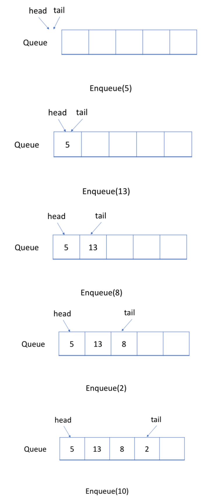
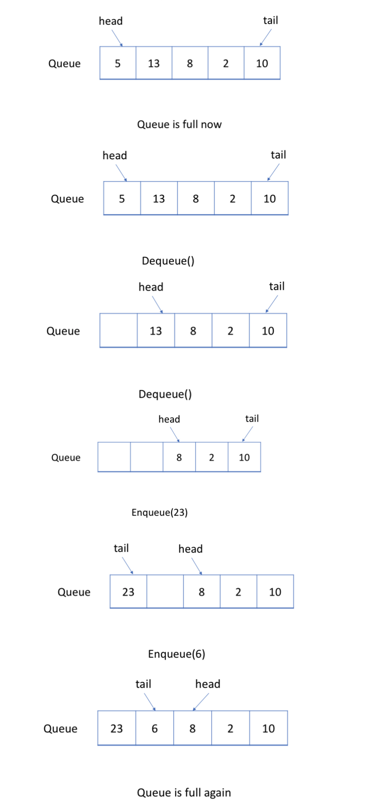
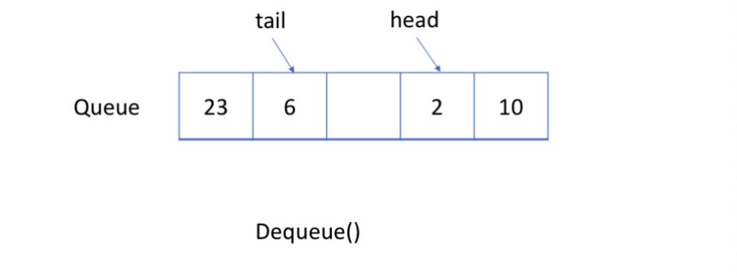

# Queue

**First-in-first-out** (FIFO)

: A queue is a linear list of elements in which

* **deletions** can take place only at one end called **front** and
* **insetions** can take place only at the other end called the **rear.**

## Circular Queue

A more efficient way is to use a circular queue. Specifically, we may use `a fixed-size array` and `two pointers` to indicate the starting position and the ending position. And the goal is to `reuse the wasted storage` we mentioned previously.

Let's take a look at an example to see how a circular queue works. You should pay attention to the strategy we use to `enqueue` or `dequeue` an element.

