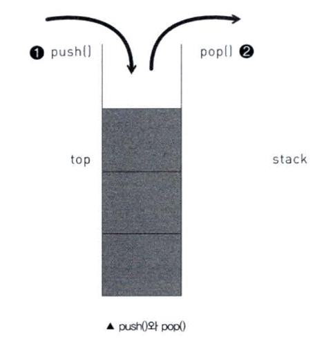

# Stack

: A stack is a list of elements in which an elements may be **inserted or deleted only at one end **called the **TOP** of the stack.

- **LIFO (Last in First Out)**

햄버거에 비유: 

* push : inset elements into stack. 햄버거 빵 위에 패트 넣기.
* pop: delete elements from stack. 햄버거 빵 위에 패트 빼기
* peek:  햄버거 맨위에 올려져 있는 재료가 뭔지 보기.
