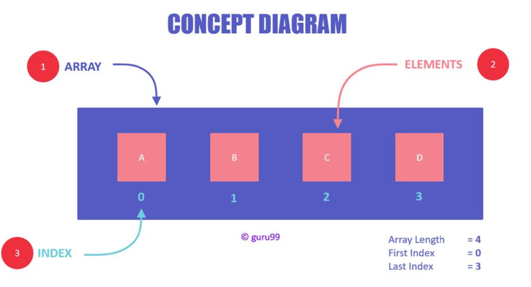
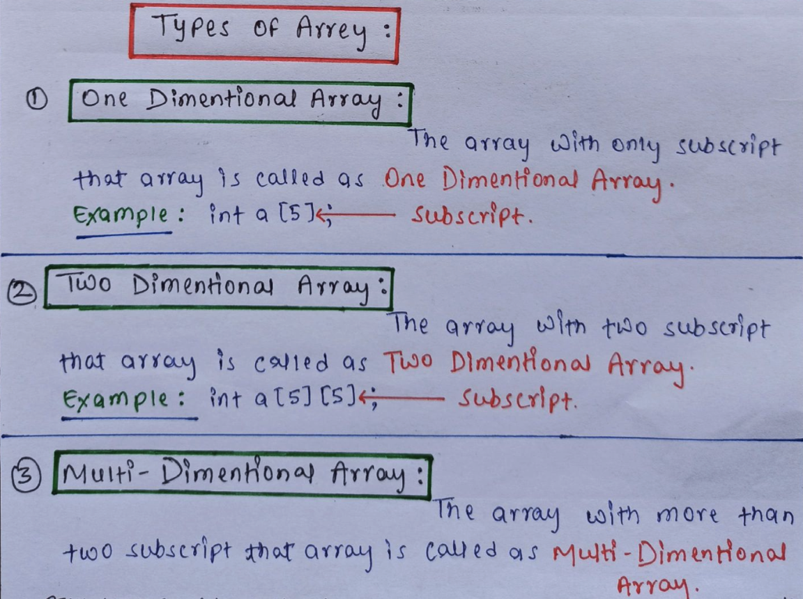

# Array

## Array(배열)란?

: 순서가 있는 리스트

: A collection of elements(data) stored **next** to each other.

Arrays are _fixed length_ & the size is _defined_ when you create the array.

⇒ **한 배열안에는 동일안 데이터 넣기.**

**사실 서로 다른 데이터 넣기 가능하지만. 문제가 생길 확율 너무 높으니 하지마!**

When you need an array-like data structure that offers dynamic resizing, you would usually use an ArrayList. An ArrayList is an array that resizes itself as needed while still providing O(1).

A typical implementation is that when the array is full, the array double in size. Each doubling takes O(n)time, but happens so rarely that is amortized insertion time is still O(1).

