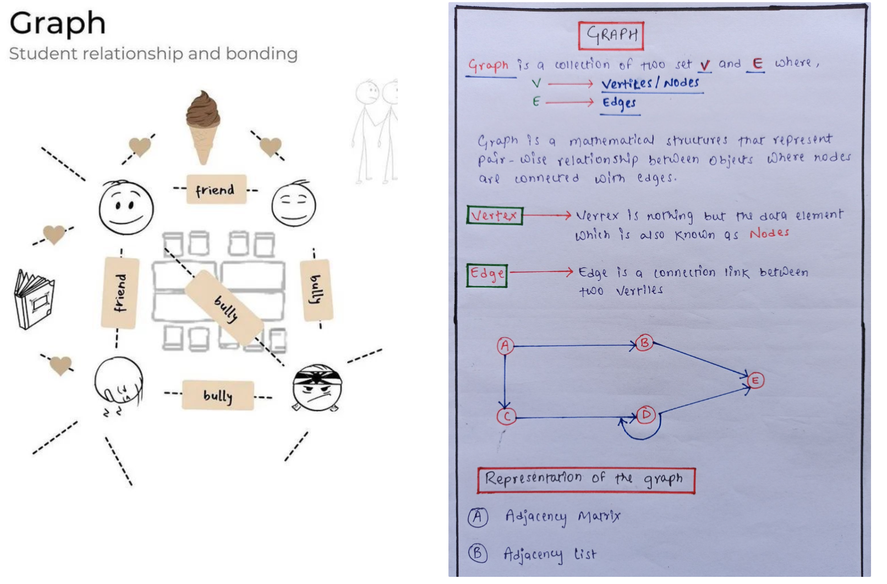
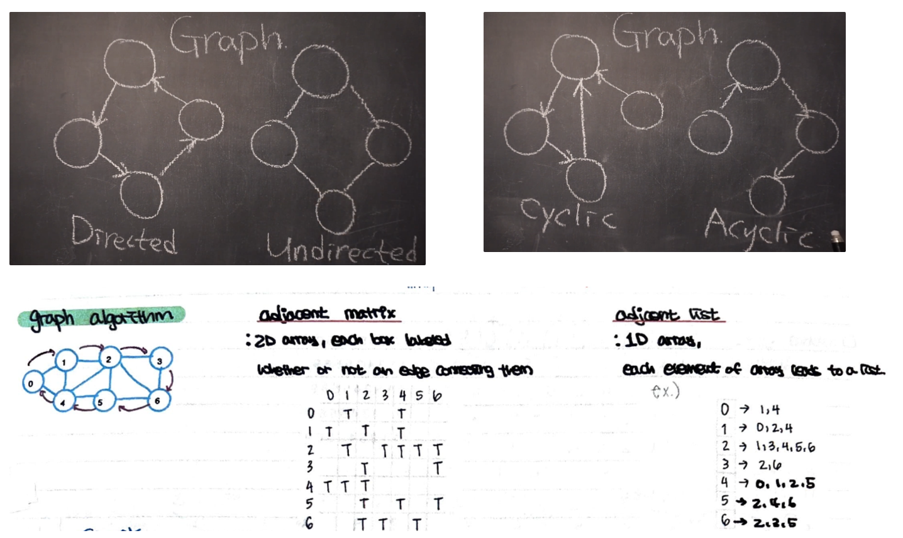
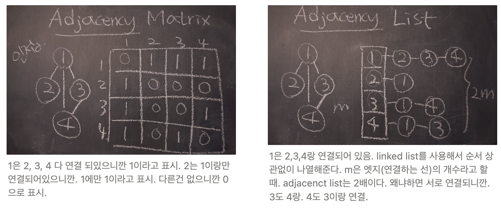

# Graph (Non-linear)

## Graph를 표현하는 방법

* Adjacency (제이슨시) matrix
  * 2D array, each box labeled whether or not an edge connecting them.
* Adjacency list (linked list)
  * 1D array, each element of array leads to a list.

[Youtube](https://www.youtube.com/watch?v=fVcKN42YXXI)

