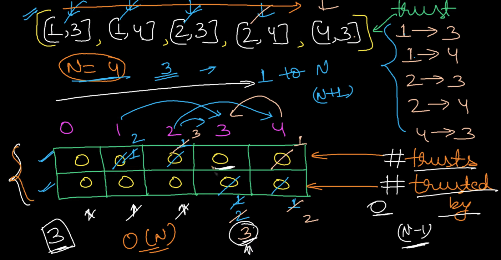

# **Find the Town Judge (Easy)**

In a town, there are `n` people labeled from `1` to `n`. There is a rumor that one of these people is secretly the town judge.

If the town judge exists, then:

1. The town judge trusts nobody.
2. Everybody (except for the town judge) trusts the town judge.
3. There is exactly one person that satisfies properties **1** and **2** .

You are given an array `trust` where `trust[i] = [ai, bi]` representing that the person labeled `ai` trusts the person labeled `bi`. If a trust relationship does not exist in `trust` array, then such a trust relationship does not exist.

Return _the label of the town judge if the town judge exists and can be identified, or return_ `-1` _otherwise_ . (`만약 신뢰를 받는 사람이 없다면 -1을 반환` )

**Example 1:**

```
Input: n = 2, trust = [[1,2]]
Output: 2

# 1이 2를 믿는다. but 2는 1번을 믿지 않는다.
# 그러므로 타운저지는 2다.
```

**Example 2:**

```
Input: n = 3, trust = [[1,3],[2,3]]
Output: 3
```

**Example 3:**

```
Input: n = 3, trust = [[1,3],[2,3],[3,1]]
Output: -1

# 여기에서는 1이 3를 믿고 2는 3를 믿는데 3이 1번을 믿어버렸으므로 -1.
# 타운지지는 아무도 믿지 않는다.
```

## Youtube 개념 이해하기.

[https://www.youtube.com/watch?v=ZUP_tIs4VaE](https://www.youtube.com/watch?v=ZUP_tIs4VaE)



[1,3] = 1이 3를 지지한다는 뜻.

trusts는 내가 누군가를 지지하는 수

tursted by는 내가 지지받은 수. (이게 많아야 당선이 됨).

(n-1)이면 4-1 = 3인데 여기서 trusted by(지지 받는 표) 를 봤을때 3인건 index3이다.

### **Approach 1: Two Arrays**

**Intuition**

The `trust` relationships form a graph. Each `trust` pair, `[a, b]` represents a **directed edge** going from `a` to `b`.

For example, with `N = 5` and `trust = [[1,3],[2,3],[4,3],[4,1],[5,3],[5,1],[5,4]]`, we get the following graph. Who is the town judge?

```python
'''
Input: n = 3            => 사람의 수
trust = [[1,3],[2,3]]   => [신뢰자. 신뢰받는자]
Output: 3

                  0  1  2  3                        0  1  2  3
trustor              1         => trustor              1  1
vote_town_judge            1      vote_town_judge            2
                                                    n-1 => 3-1 => 2 그러므로 index3 출력.
'''


class Solution:
    def findJudge(self, n: int, trust: List[List[int]]) -> int:
        # 이는 모든 사람이 다른 사람을 믿어야 하므로 최소한 n - 1개의 신뢰 관계가 필요한 조건입니다.
        if len(trust) < n - 1:  # 만약 신뢰 관계의 수가 n - 1보다 작다면, 신뢰를 받는 사람을 찾을 수 없다고 판단.
            return -1  # -1 반환

        # 0으로 초기화.
        vote_town_judge = [0] * (n + 1)  # vote_town_judge. 신뢰를 몇명한테 받앗는지 세기  # 0
        trustor = [0] * (n + 1)  # trustor. 신뢰자가 몇명인지 세기      # 0

        # (a, b)가 주어지면, a는 b를 믿는 것이므로 trustor[a]를 증가시키고,
        # b는 a로부터 믿음을 받으므로 vote_town_judge[b]를 증가시킵니다.
        for a, b in trust:
            trustor[a] += 1          # trustor[1] = 1           => trustor[2] = 1
            vote_town_judge[b] += 1  # vote_town_judge[3]  = 3 => vote_town_judge[3]  = 2

        # 각 사람에 대해 vote_town_judge가 n - 1이고 trustor가 0이면, 그 사람은 모든 다른 사람으로부터 믿음을 받는 유일한 사람으로 판단됩니다.
        for i in range(1, n + 1):  # range(1,4)
            if vote_town_judge[i] == n - 1 and trustor[i] == 0:  # if (vote_town_judge)[3] == 3 and trustor[3]== 0
                return i  # 해당 사람의 인덱스를 반환                  # return 3

        # 만약 신뢰를 받는 사람이 없다면 -1을 반환
        return -1

# 입력
n = 3
trust = [[1,3],[2,3]]

# Solution 클래스의 인스턴스 생성
sol = Solution()

# 함수 호출하여 결과 출력
print(sol.findJudge(n, trust))
```


### **Approach 2: One Array**

**Intuition**

Just to be clear, there's nothing wrong with Approach 1. If you got it, you're doing great! Approach 2 is a little more subtle. Coming up with these kinds of approaches is something you'll learn to do with experience.

We don't need separate arrays for indegree and outdegree. We can instead build a single Array with the result of `indegree - outdegree` for each person. In other words, we'll `+1` to their "score" for each person they are trusted by, and `-1` from their "score" for each person they trust. Therefore, for a person to maximize their "score", they should be trusted by as many people as possible, and trust as few people as possible.

The maximum indegree is `N - 1`. This represents everybody trusting the person (except for themselves, they cannot trust themselves). The minimum indegree is `0`. This represents not trusting anybody. Therefore, the maximum value for `indegree - outdegree` is `(N - 1) - 0 = N - 1`. These values also happen to be the definition of the town judge!

> The town judge is the only person who could possibly have indegree - outdegree equal to N - 1.

**Algorithm**

Each person gains `1` "point" for each person they are trusted by, and loses `1` "point" for each person they trust. Then at the end, the town judge, if they exist, must be the person with `N - 1` "points".

```python
def findJudge(self, N: int, trust: List[List[int]]) -> int:

    if len(trust) < N - 1:
        return -1

    trust_scores = [0] * (N + 1)

    for a, b in trust:
        trust_scores[a] -= 1
        trust_scores[b] += 1
  
    for i, score in enumerate(trust_scores[1:], 1):
        if score == N - 1:
            return i
    return -1
```
