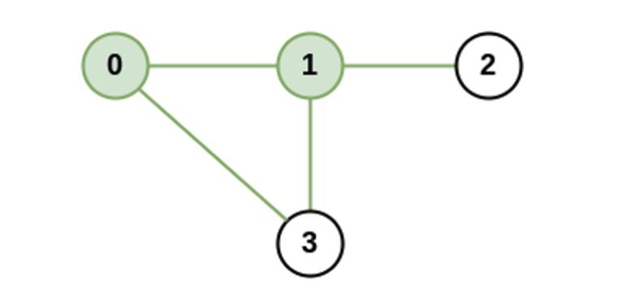
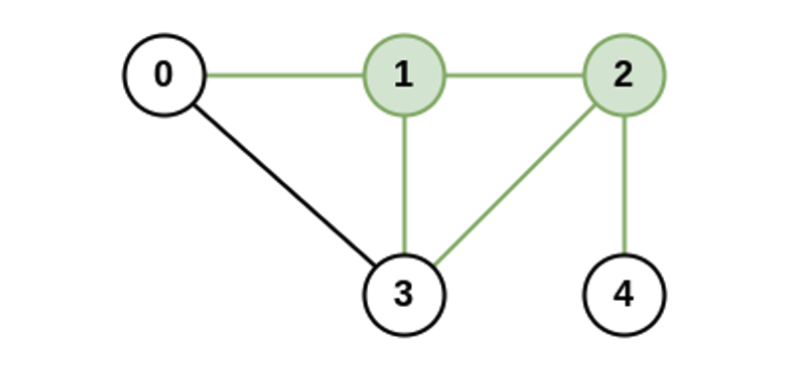
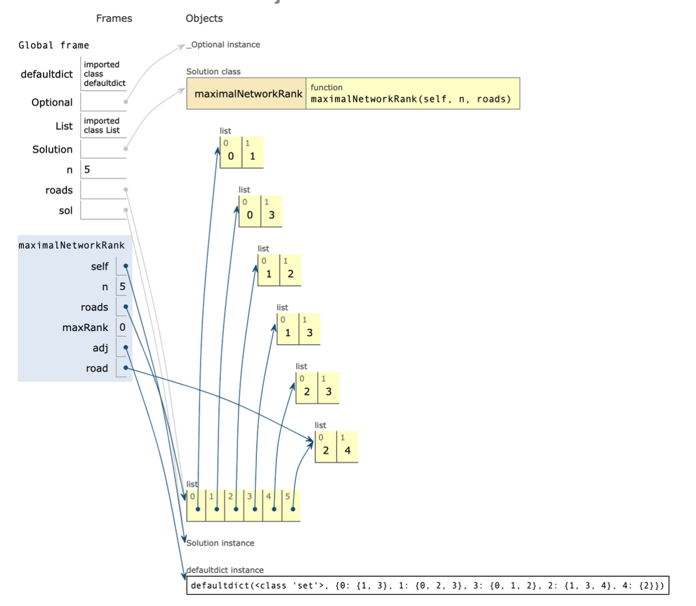
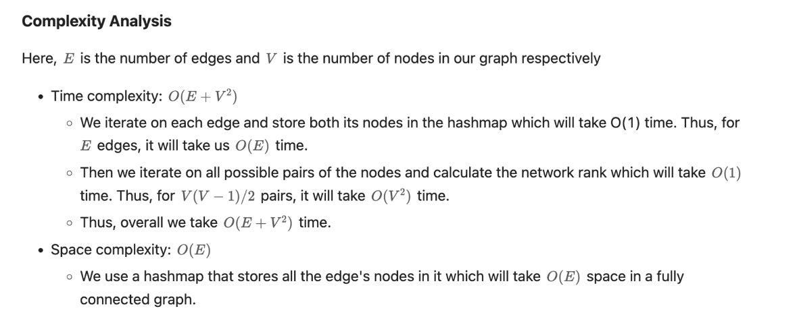

# **Maximal Network Rank (medium)**

There is an infrastructure of `n` cities with some number of `roads` connecting these cities. Each `roads[i] = [ai, bi]` indicates that there is a bidirectional road between cities `ai` and `bi`.

The **network rank** **of **two different cities** is defined as the total number of **directly** connected roads to **either** city. If a road is directly connected to both cities, it is only counted **once\*\* .

The **maximal network rank** of the infrastructure is the **maximum network rank** of all pairs of different cities.

Given the integer `n` and the array `roads`, return _the **maximal network rank** of the entire infrastructure_ .

**Example 1:**



```
Input: n = 4, roads = [[0,1],[0,3],[1,2],[1,3]]
Output: 4
Explanation: The network rank of cities 0 and 1 is 4 as there are 4 roads that are connected to either 0 or 1. The road between 0 and 1 is only counted once.
```

**Example 2:**



```
Input: n = 5, roads = [[0,1],[0,3],[1,2],[1,3],[2,3],[2,4]]
Output: 5
Explanation: There are 5 roads that are connected to cities 1 or 2.
```

**Example 3:**

```
Input: n = 8, roads = [[0,1],[1,2],[2,3],[2,4],[5,6],[5,7]]
Output: 5
Explanation: The network rank of 2 and 5 is 5. Notice that all the cities do not have to be connected.
```

Here are two ways to implement this approach:

1. We can keep an integer array or a hash map to map a `node` with the count of its edges, i.e. store the in-degree of each node `i` at `indegree[i]`.
   And another boolean matrix in which `isConnected[node1][node2]` represents if `node1` and `node2` are connected or not.
2. We can keep an array or hash map, which maps the `node` with the hash set of nodes it is connected to. Here, the size of the hash set will give the in-degree of the respective node and we can find if `node2` exists in the hash set of `node1` to check if they are directly connected or not.

The worst-case time and space complexity will remain the same in both implementations. Here, we will show you the implementation of the latter one.

The worst-case time and space complexity will remain the same in both implementations. Here, we will show you the implementation of the latter one.

### **Algorithm**

1. Initialize variables:
   - `maxRank`, a variable to store the maximum network rank found so far.
   - `adj`, a hash map of the hash set to store the nodes in the hash set connected to respective nodes.
2. Using two nested for-loops iterate on each possible node pair `(node1, node2)`, and calculate its network rank as discussed earlier.
   - Thus `currentRank` will be `indegree of node1 + indegree of node2 - (1 if node1 is connected to node2)`
   - If `currentRank` is greater than `maxRank`, then update `maxRank`.
3. Return `maxRank`.

```python
from collections import defaultdict
from typing import Optional, List

class Solution:
    def maximalNetworkRank(self, n: int, roads: List[List[int]]) -> int:
        maxRank = 0  # 최대 네트워크 랭크를 저장할 변수를 초기화합니다. #도로의 총수
        adj = defaultdict(set)  # 각 도시의 연결된 도시들을 저장할 defaultdict를 생성합니다.
        # 기본값이 빈 집합(set)인 딕셔너리를 생성하는 것. 각 도시를 키(key)로 사용하고,
        # 그 도시와 직접적으로 연결된 다른 도시들의 집합을 값(value)으로 가지는 딕셔너리를 만들게 됩니다.

        # 주어진 도로 정보를 토대로 adj 리스트를 만듭니다.
        for road in roads:
            adj[road[0]].add(road[1]) # 두개의 도시를 연결하므로 [0,0]이 아닌 [0,1]부터이다.
                                      # adj[road[0]]은 첫 번째 도시와 연결된 다른 도시들의 집합이 되고,
                                      # 여기에 add(road[1])이라고 하면 두 번째 도시를 추가한다는 뜻이에요.
            adj[road[1]].add(road[0]) # 반대로 양쪽이 연결되는것. 위에가 [0,1] 이면 여기는 [1,0]이라는 뜻.

        # 모든 가능한 도시 쌍에 대해 반복합니다.
        for node1 in range(n):
            for node2 in range(node1 + 1, n):   # node1보다 큰 값부터 n-1까지
                # 현재 도시 쌍의 네트워크 랭크를 계산합니다.
                currentRank = len(adj[node1]) + len(adj[node2])  # len(adj[node1])은 첫 번째 도시와 연결된 다른 도시의 수를 나타내고,
                                                                 # len(adj[node2])는 두 번째 도시와 연결된 다른 도시의 수

                # 만약 두 도시가 이미 연결되어 있다면, 중복으로 세어지는 것을 방지하기 위해 1을 빼줍니다.
                if node2 in adj[node1]:
                    currentRank -= 1

                # 현재 도시 쌍의 네트워크 랭크가 최대 랭크보다 크다면 최대 랭크를 업데이트합니다.
                maxRank = max(maxRank, currentRank)

        # 최대 네트워크 랭크를 반환합니다.
        return maxRank

# 입력
n = 5
roads = [[0,1],[0,3],[1,2],[1,3],[2,3],[2,4]]

# Solution 클래스의 인스턴스 생성
sol = Solution()

# 함수 호출하여 결과 출력
print(sol.maximalNetworkRank(n, roads))
```



따라서 **`adj`** 딕셔너리는 아래와 같은 구조를 가질 것입니다:

- adj[0] = {1, 3}
- adj[1] = {0, 2, 3}
- adj[2] = {1, 3, 4}
- adj[3] = {0, 1, 2}
- adj[4] = {2}

이제 **`currentRank = len(adj[node1]) + len(adj[node2])`** 코드를 살펴보겠습니다.

첫 번째 반복문에서 **`node1`**을 기준으로 하고, 두 번째 반복문에서 **`node2`**를 기준으로 합니다. 이때 **`node1`**과 **`node2`**는 서로 다른 도시입니다.

주어진 도로 리스트를 토대로 각 도시의 이웃 수를 확인해보겠습니다.

- 도시 0의 이웃 수: 2 (도시 1과 도시 3)
- 도시 1의 이웃 수: 3 (도시 0, 2, 3)
- 도시 2의 이웃 수: 3 (도시 1, 3, 4)
- 도시 3의 이웃 수: 3 (도시 0, 1, 2)
- 도시 4의 이웃 수: 1 (도시 2)

따라서, 도시 0과 도시 1의 이웃 수는 각각 2와 3입니다. 이제 이 값을 이용하여 **`currentRank`**를 계산해 보겠습니다.

도시 0과 도시 1을 선택했을 때, **`currentRank = len(adj[0]) + len(adj[1])`**이므로, **`currentRank = 2 + 3 = 5`**가 됩니다.

**`if node2 in adj[node1]`**는 두 도시가 이미 연결되어 있는지를 확인하는 조건문입니다. 만약 도시 1이 도시 0의 이웃에 포함되어 있다면(즉, 이미 도로로 연결되어 있다면), 중복으로 세어지는 것을 방지하기 위해 **`currentRank`**에서 1을 뺍니다.


