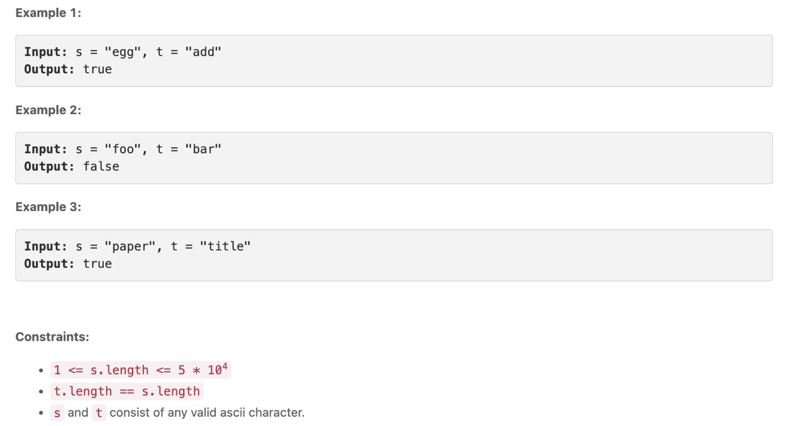
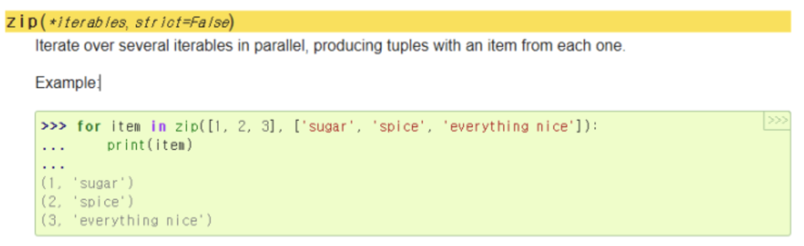
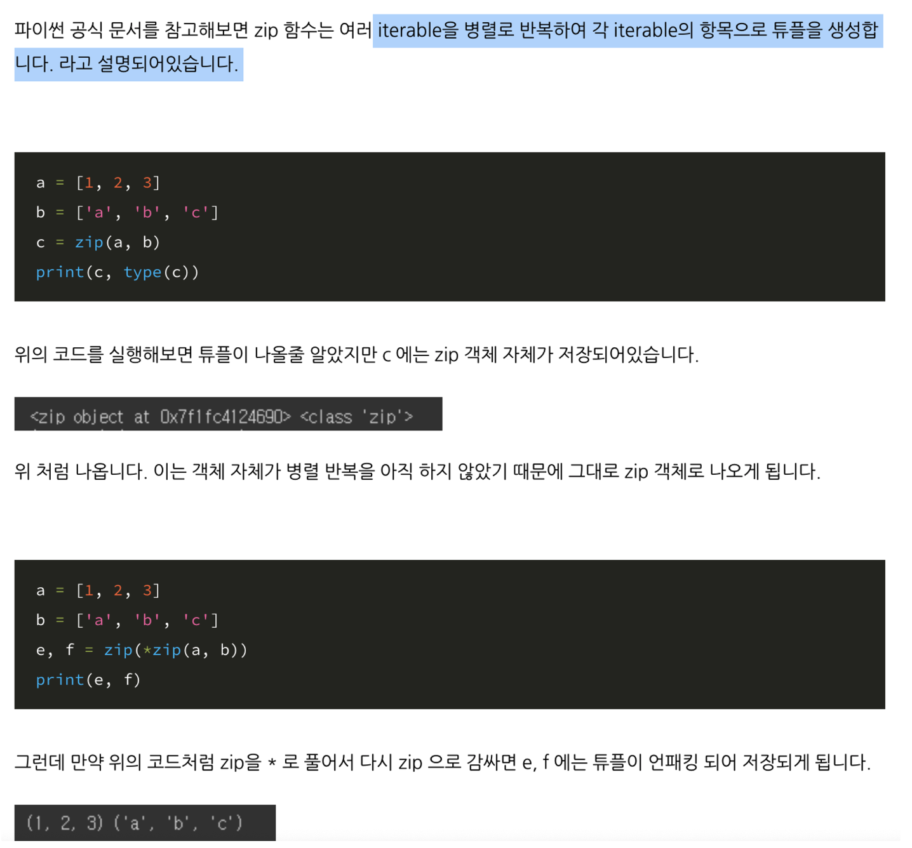

# Isomeorphic Strings

Given two strings `s` and `t`, _determine if they are isomorphic_ .

Two strings `s` and `t` are isomorphic if the characters in `s` can be replaced to get `t`.

All occurrences of a character must be replaced with another character while preserving the order of characters. No two characters may map to the same character, but a character may map to itself.



## "Isomorphic Strings"란

두 문자열이 서로 대응 관계를 가지며, 각 문자가 다른 문자로 대응되는 경우를 나타내는 프로그래밍 용어입니다. 즉, 두 문자열 간에 일대일 대응 관계가 있어야 합니다. 예를 들어, "egg"와 "add"는 isomorphic strings의 예시입니다. 여기서 'e'는 'a'로 대응되고, 'g'는 'd'로 대응됩니다.

### zip

```
#zip
kor = ['사과', '바나나','오렌지']
eng = ['apple', 'banana', 'orange']

result = zip(kor,eng)
print(result)       # <zip object at 0x7fed582a75c0>

mixed_result = list(result)
print(mixed_result) # [('사과', 'apple'), ('바나나', 'banana'), ('오렌지', 'orange')]

#unzip
result2 = zip(*mixed_result)
print(result2)  #<zip object at 0x7f8338287700>

no_mixed_result = list(result2)
print(no_mixed_result) #[('사과', '바나나', '오렌지'), ('apple', 'banana', 'orange')]

# 튜플 = ()
print(list(no_mixed_result[0])) #['사과', '바나나', '오렌지']
print(list(no_mixed_result[1])) #['apple', 'banana', 'orange']
```




