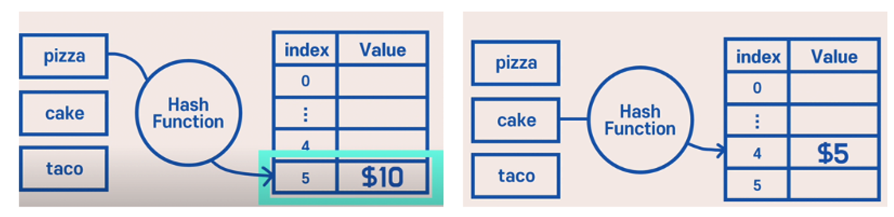
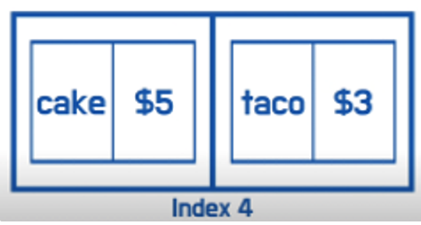
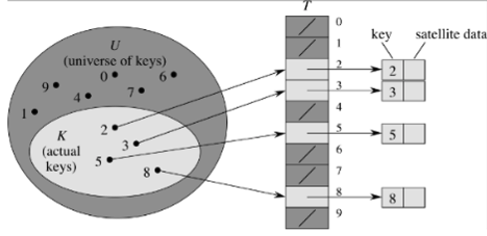
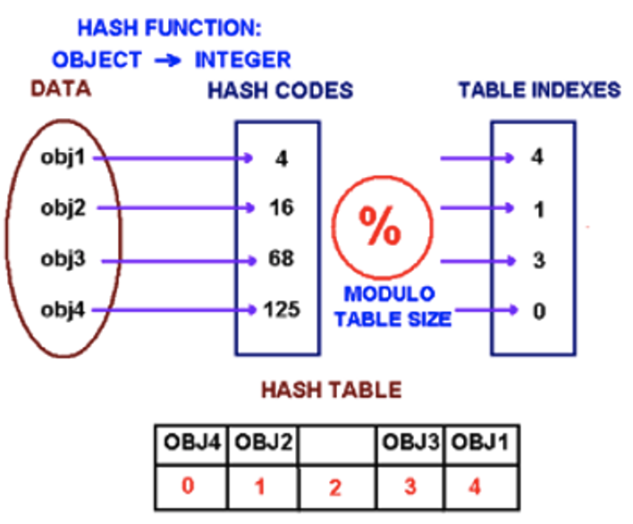
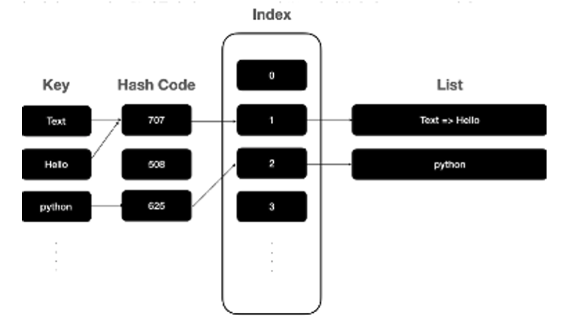
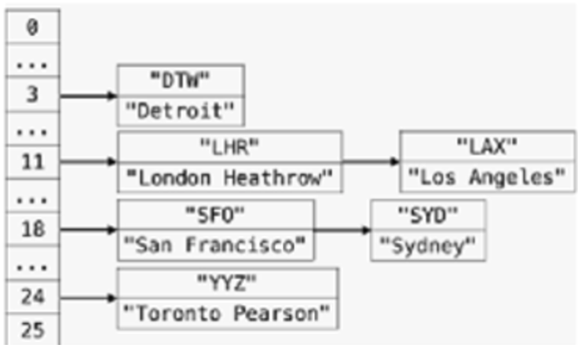
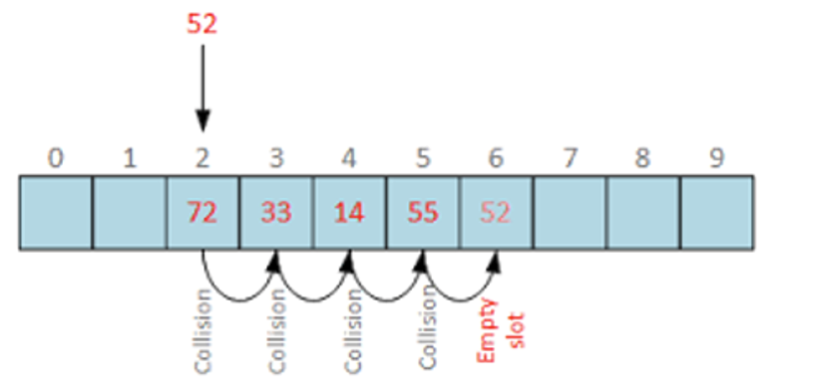
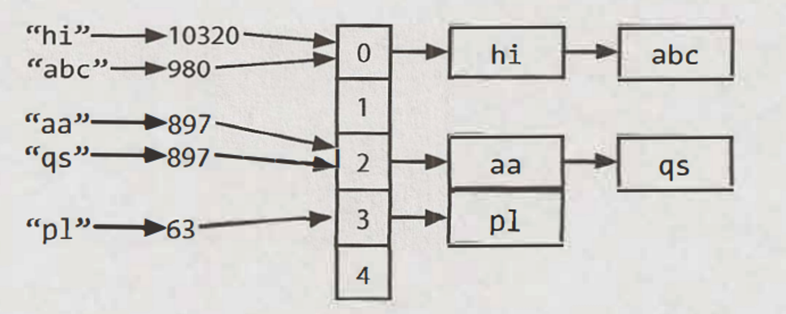

# Hash

## Hash Tables (키 : 값)

: A `b` is a data structure that maps keys to values for highly efficient lookup. There are a number of ways of implementing this. (**키값을 수치로 변환하는 함수.)**

`Hash Table` is a data structure which organizes data using `hash functions` in order to support quick insertion and search.

- `hash table`:
  - 해시 테이블은 해시맵과 비슷한 개념을 가지고 있습니다.
  - 키(key)와 값(value)을 저장하는 자료구조이지만, 값(value) 대신 데이터(data)를 저장하기도 합니다. 즉, 해시 테이블은 키(key)와 이에 해당하는 데이터(data)를 매핑하여 저장하는 자료구조입니다. 따라서 해시 테이블에 저장되는 데이터(data)는 값(value)이 될 수도 있고, 다른 형태의 데이터가 될 수도 있습니다.
  - 해시 테이블은 일반적으로 해시 충돌(두 개 이상의 키가 동일한 해시 값으로 매핑되는 상황)을 처리하기 위한 방법이 내장되어 있습니다.
  - 많은 프로그래밍 언어에서 해시 테이블은 해시맵과 유사한 기능을 제공합니다.

There are two different kinds of hash tables: **hash set** and **hash map.**

- The `hash set` is one of the implementations of a `set` data structure to store `no repeated values`.
  - 해시셋은 값(value)만을 저장하는 자료구조입니다. 즉, 중복된 값을 허용하지 않습니다.
  - 해시셋은 내부적으로 해시맵을 사용하여 각 값의 유일성을 보장합니다.
  - 주어진 값이 이미 해시셋에 존재하는지 여부를 빠르게 확인할 수 있습니다.
  - 예를 들어, 파이썬의 **`set`** 타입이 해시셋의 대표적인 예시입니다.
- The `hash map` is one of the implementations of a `map` data structure to store `(key, value)` pairs.
  - 해시맵은 키(key)와 값(value)을 저장하는 자료구조입니다.
  - 특정 키를 해시 함수를 통해 인덱스로 변환하고, 해당 인덱스에 값(value)을 저장합니다.
  - 각 키는 유일해야 하며, 동일한 키에 대해 여러 개의 값이 저장될 수 없습니다.
  - 예를 들어, 파이썬에서는 **`dict`** 타입이 해시맵의 대표적인 예시입니다.

By choosing a proper hash function, the hash table can achieve `wonderful performance` in both insertion and search.

Array로 내가 원하는 음식을 검색할려면 하나하나 찾아야 되지만 **Hash table 사용할때는 한번에 찾기 가능.**

### **해시 테이블Hash table이란?**

**해시** **함수 + 배열을** **합치면 '해시** **테이블(Hash Table)'**이라는 자료구조를 얻을 수 있습니다. 해시 테이블은 해시 맵, 딕셔너리, 연관 배열 이라는 이름으로도 알려져 있습니다.

[https://www.youtube.com/watch?v=HraOg7W3VAM](https://www.youtube.com/watch?v=HraOg7W3VAM)

배열을 사용해서 정리를 해둔 후 hash function을 사용해서 바로 찾는다.

이 경우에는 Pizza는 key이고 그걸 hash function에 넣는다. 그럼 index 5라고 나오고 그걸 value에 저장한다.

**즉! Key를 가져다가 해시함수에 넣고, 해시함수가 준 숫자에, value를 저장한다.**

**하지만!**

**충돌이 생긴경우**

**Cake이라는 키를 해시함수에 넣으면 숫자 4가 나오고 그걸 리스트 4로 이동하여 cake 찾기. 근데 이때 찾을 때 선형검색이 달라질수 있다.**

### 파이썬에서 해시(Hash)는 어떻게 구현할 수 있을까요!?

파이썬에서는 **Dictionary** 라는 자료구조를 통해 해시를 제공합니다. 그리고 **Dictionary**는 **dict클래스**에 구현되어있습니다!

**원소를** **넣거나** **삭제, 찾는** **일이** **많을** **때에는** **딕셔너리를** **사용하는** **것이** **좋습니다**

### **해시** **언제** **사용하면** **좋을까?!**

**Hashing** **(아주** **빠르게** **삽입** **하거나** **가져올** **때** **사용함)**

1. **리스트를** **쓸** **수** **없을** **때**

리스트는 숫자 인덱스를 이용하여 원소에 접근하는데 즉 list[1]은 가능하지만 list['a']는 불가능합니다.

인덱스 값을 숫자가 아닌 다른 값 '문자열, 튜플'을 사용하려고 할 때 딕셔너리를 사용하면 좋습니다.

2. **빠른** **접근 / 탐색이** **필요할** **때**

딕셔너리 함수의 시간복잡도는 대부분 O(1)이므로 아주 빠른 자료구조 입니다!

3. **집계가** **필요할** **때**

원소의 개수를 세는 문제는 코딩 테스트에서 많이 출제되는 문제입니다. 이때 **해시**와, **collections** 모듈의 **Counter** 클래스를 사용하면 **아주 빠르게 문제를 푸실 수 있을 것**입니다.

- Problem: range of keys too large to have position for every possible one
  - CUNY Id NNNNNNNN (eight digits)
  - Social Security Number NNN-NN-NNNN (nine digits)
  - Phone Number NNN-NNN-NNNN (ten digits)
  - Bank Account Number (arbitrarily many digits)

### **Hash Function example**

- Compute some function of the original data so it maps into a smaller domain
- Function should produce a “uniform distribution” in the target space
- Use **“/” DIV (division)** by power of 10 to extract **most significant digits (MSD)**
- Use **“%”** **MOD (modulo)** by power of 10 to extract **least significant digits (LSD)**
- What would you use for these aforementioned examples?
  - CUNY Id NNNNNNNN (eight digits)
  - Social Security Number NNN-NN-NNNN (nine digits)
  - Phone Number NNN-NNN-NNNN (ten digits)
  - Bank Account Number (arbitrarily many digits)
- Note: MOD is often used in conjunction with a prime number (not a power of 10) to achieve the desired distribution

num % 5

### Hash Function: **Collision** Example

- Once we no longer use “direct addressing”, we run the risk of collisions - two or more different keys hashing to the same position
- Keys are phone numbers and hash is h(k) = k mod 10000
- Thereby extract the last four digits of the phone number
  - Phone number 917-987-**1234** maps to 1234
  - Phone number 646-567-**1234** maps to 1234
  - **Collision** !

#### **Collision-Resolution**

1. **Separate Chaining** (aka Chaining) - create lists emerging from array

   - Create a chain (i.e. linked list) of all elements mapped to same slot

   
2. **Open Addressing** - store all data within the array itself

   - **Keep all keys within the table itself**

- Where to place key just hashed?
- Option 1: **look for a different place (“probing 면밀히 살피는/ 진실을 캐기 위한”)**
- Option 2: **take the spot and find a new place for the data previously there**
- Question: how to handle deletions? We may give the impression that there never was any element there, so we will not do any probing

  - Solution: remove the record, but keep some kind of placeholder to indicate prior presence

  

    마지막 숫자가 2인데 충돌이 있고 다른 수 들이 다른칸에 있어서 맨 뒤에 빈칸에 52 넣기.

1. first, compute the key’s hash code, which will usually be an int or long. Note that two different keys could have the same hash code, as there may be an infinite number of keys and a finite number of ints.
2. Then, map the hash code to an index in the array. This could be done with something like hash(key) % array_length. Two different hash codes could, of course, map to the same index.
3. At this index, there is **a linked list of keys and values.** Store the key and value in this index. We must use a linked list because of **collisions** : **you could have two different keys with the same hash code, or two different hash codes that map to the same index.**

If the number of collision is very high, worst: O(N). (N is the number of keys) However, we generally assume a good implementation that keeps collisions to a minimum, in which case the lookup is O(1)

Alternatively, we can implement the hash table with a balanced binary search tree. O(log N).
