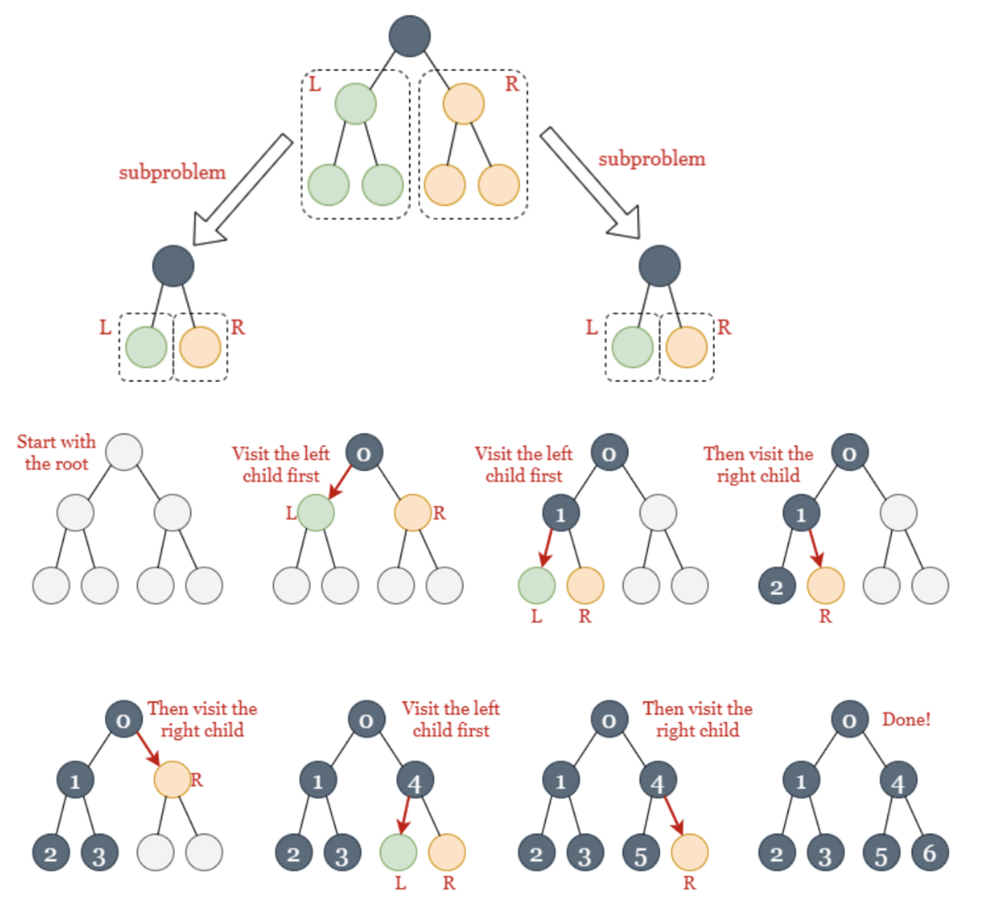

# **Binary Tree Preorder Traversal**

Given the `root` of a binary tree, return _the preorder traversal of its nodes' values_ .


**Example 1:**

```
Input: root = [1,null,2,3]
Output: [1,2,3]
```

**Example 2:**

```
Input: root = []
Output: []

```

**Example 3:**

```
Input: root = [1]
Output: [1]
```

## 1. Recursion



```python

# Definition for a binary tree node.
# class TreeNode(object):
#     def __init__(self, val=0, left=None, right=None):
#         self.val = val
#         self.left = left
#         self.right = right
class Solution(object):
    def preorderTraversal(self, root):
        """
        :type root: TreeNode
        :rtype: List[int]
        """
        # initialize an empty array 'empty_array'
        empty_array =[]

        #start with the root node 'root'. if 'root' is not NULL
        def bt(node):
            if not node:
                return
            empty_array.append(node.val)
            bt(node.left)
            bt(node.right)

        bt(root)
        return empty_array
```


## 2. Iteration 반복 (more simple answer) **(Data→ Left → Right)**

We can also implement DFS iteratively using a **stack** to replicate recursive calls. Note that the operations on the stack follow the first-in-last-out order. The node we add last is visited first. Therefore, to access the left child before the right child, we **add the right child before the left child**.


### **Algorithm**

1. Initialize an empty array `answer` and an empty stack `stack`.
2. Add `root` to `stack`.
3. While `stack` is not empty, get the top node `currNode` from `stack`. If `currNode` is not NULL:

   - add its value to `answer`.
   - add its right child to `stack`.
   - add its left child to `stack`.

   Then repeat step 3.
4. Return `answer` after we empty `stack`.

   ```python
   class Solution:
       def preorderTraversal(self, root: TreeNode) -> List[int]:
           answer = []
           stack = [root]

           # Note that we add curr_node's right child to the stack first.
           while stack:
               curr_node = stack.pop()
               if curr_node:
                   answer.append(curr_node.val)
                   stack.append(curr_node.right)
                   stack.append(curr_node.left)

           return answer
   ```


## Iteration - Youtube explanation and answer!

[yutube](https://www.youtube.com/watch?v=afTpieEZXck)

```python
'''
Input: root = [1,null,2,3]
Output: [1,2,3]

(Data→ Left → Right) L

    1
  /   \
2       3
      /   \
    4       5
'''
# iteration
# Definition for a binary tree node.
# class TreeNode(object):
#     def __init__(self, val=0, left=None, right=None):
#         self.val = val
#         self.left = left
#         self.right = right
class Solution:
    def preorderTraversal(self, root: TreeNode) -> List[int]:
        stack =[]
        res=[]
        curr = root

        while stack or curr:             # curr = 1    # stack=[3]        # stack =[3.null]   # stack =[3]  # curr= 3       # curr=4           # stack =[5,null]  #stack =[5]  # curr=5           # 둘다 null
            if curr:                                                      # null              # null        # 3             # 4                # null                          # 5
                res.append(curr.val)     # res = [1]   # res = [1.2]                                        # res= [1,2,3]  # res = [1,2,3,4]                                  # rest=[1,2,3,4,5]
                stack.append(curr.right) # stack= [3]  # stack =[3.null]                                    # stack =[5]    # stack =[5,null]                                  # stack = [null]
                curr = curr.left         # curr = 2    # curr = null                                        # curr= 4       # null                                             # null
            else:
                curr = stack.pop()                                       # curr = null빼기     # curr= 3빼기                                      # curr= null빼기   # curr= 5빼기                 
        return res                                                                                                                                                                                  # res=[1,2,3,4,5]
```
