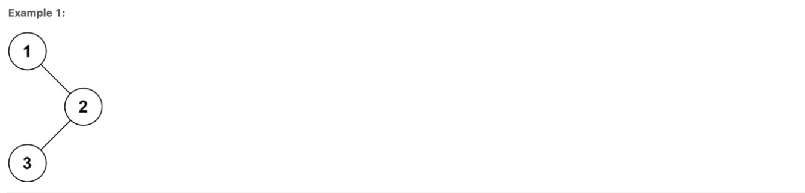
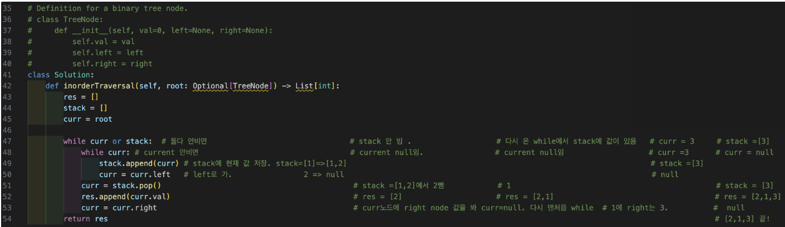

# **Binary Tree Inorder Traversal**

**Binary Tree Inorder Traversal (Left → Data → Right)**

Given the `root` of a binary tree, return _the inorder traversal of its nodes' values_ .



```
Input: root = [1,null,2,3]
Output: [1,3,2]
```

**Example 2:**

```
Input: root = []
Output: []
```

**Example 3:**

```
Input: root = [1]
Output: [1]
```

## **1. Recursive Approach**

```python
#     Left → Data → Right
# Definition for a binary tree node.
# class TreeNode:
#     def __init__(self, val=0, left=None, right=None):
#         self.val = val
#         self.left = left
#         self.right = right
class Solution:
    def inorderTraversal(self, root: Optional[TreeNode]) -> List[int]:
        res = []

        def inorder(root):       # 1  # 1 
            if not root:
                return
    
            #inorder traversal
            inorder(root.left)   # 2  #  젤 끝 left에 있는걸 inorder을 돌아서 계속 해서 찾음.  
            res.append(root.val) #[2] # [2,1]  #[2,1,3] 
            inorder(root.right)       #  3  

        inorder(root) #재귀 함수.  # 다시 위로   #중요한 점은 중위 순회는 왼쪽 서브트리를 먼저 순회한 후 현재 노드를 처리하고, 그 다음에 오른쪽 서브트리를 순회하는 것입니다.
        return res
  

'''
  1
2   3 

'''
```


## 2. Iterative

```python

'''
     1
  2     3 

'''
#     Left → Data → Right   o(n)
# Definition for a binary tree node.
# class TreeNode:
#     def __init__(self, val=0, left=None, right=None):
#         self.val = val
#         self.left = left
#         self.right = right
class Solution:
    def inorderTraversal(self, root: Optional[TreeNode]) -> List[int]:
        res = []
        stack = []
        curr = root

        while curr or stack:  # 둘다 안비면                                # stack 안 빔 .                   # 다시 온 while에서 stack에 값이 있음   # curr = 3     # stack =[3]
            while curr: # current 안비면                                  # current null임.                # current null임                   # curr =3      # curr = null
                stack.append(curr) # stack에 현재 값 저장. stack=[1] =>[1,2]                                                                    # stack =[3]
                curr = curr.left   # left로 가.                2   => null                                                                     # null
            curr = stack.pop()                                           # stack =[1,2]에서 2뺌            # 1                                              # stack = [3]
            res.append(curr.val)                                         # res = [2]                     # res = [2,1]                                    # res = [2,1,3]
            curr = curr.right                                            # curr노드에 right node 값을 봐 curr=null. 다시 맨처음 while  # 1에 right는 3.          #  null
        return res

```


