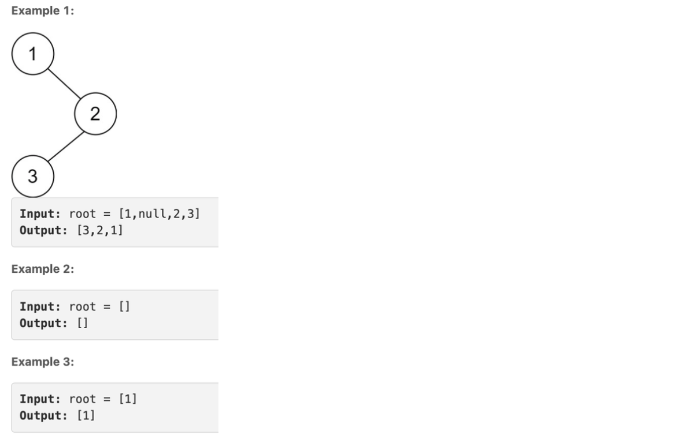
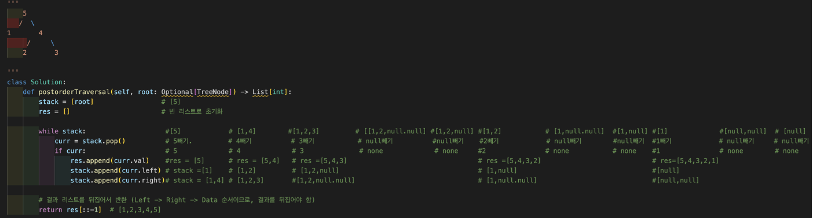

# **Binary Tree Postorder Traversal (Left → Right → Data)**

Given the `root` of a binary tree, return _the postorder traversal of its nodes' values_ .



```python
class Solution:
    def postorderTraversal(self, root: Optional[TreeNode]) -> List[int]:
        stack = [root]                 # [5]
        res = []                       # 빈 리스트로 초기화

        while stack:                    #[5]            # [1,4]        #[1,2,3]         # [[1,2,null.null] #[1,2,null] #[1,2]           # [1,null.null]  #[1,null] #[1]             #[null,null]  # [null]
            curr = stack.pop()          # 5빼기.         # 4빼기          # 3빼기           # null빼기          #null빼기    #2빼기            # null빼기        #null빼기  #1빼기            # null빼기     # null빼기
            if curr:                    # 5             # 4             # 3              # none             # none     #2               # none           # none    #1               # none        # none
                res.append(curr.val)    #res = [5]      # res = [5,4]   # res =[5,4,3]                                 # res =[5,4,3,2]                            # res=[5,4,3,2,1]
                stack.append(curr.left) # stack =[1]    # [1,2]         # [1,2,null]                                   # [1,null]                                  #[null]
                stack.append(curr.right)# stack = [1,4] # [1,2,3]       #[1,2,null.null]                               # [1,null.null]                             #[null,null]

        # 결과 리스트를 뒤집어서 반환 (Left -> Right -> Data 순서이므로, 결과를 뒤집어야 함)
        return res[::-1]  # [1,2,3,4,5]
```


