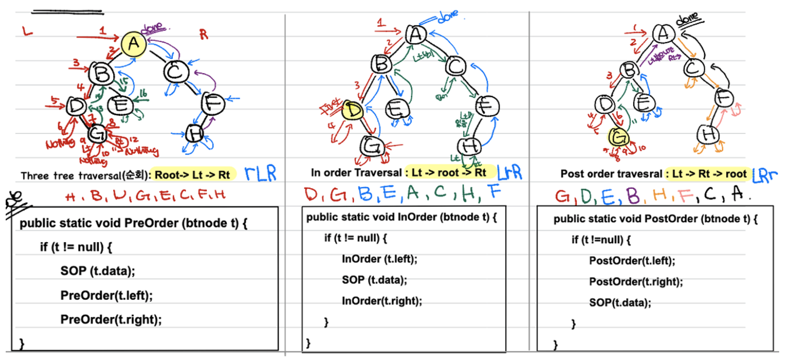
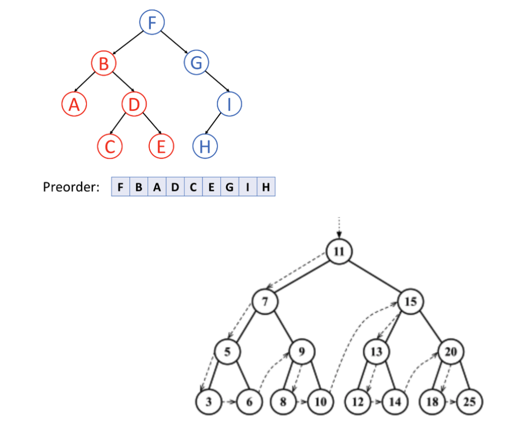
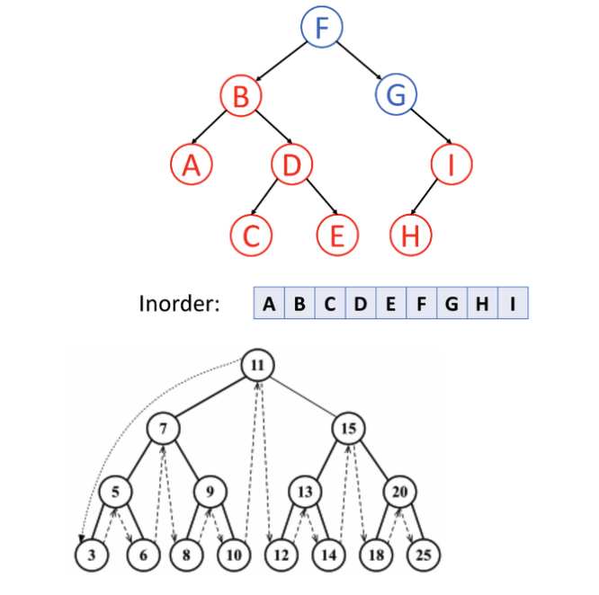
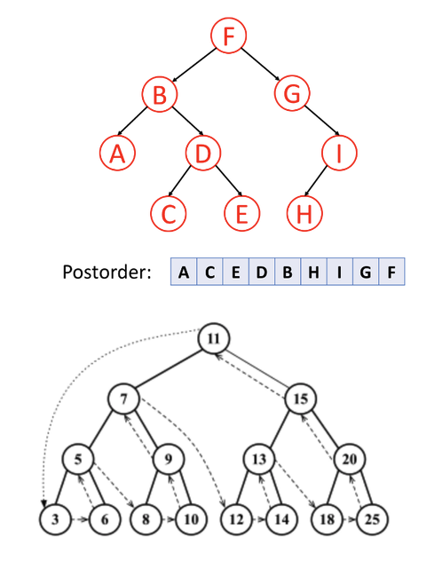

# 3 depth first traveral

Tree Traversal

* **[Pre-order Traversal](https://leetcode.com/explore/learn/card/data-structure-tree/134/traverse-a-tree/992/#pre-order-traversal) (Data→ Left → Right)    ㄴ**
* **[In-order Traversal](https://leetcode.com/explore/learn/card/data-structure-tree/134/traverse-a-tree/992/#in-order-traversal) (Left → Data → Right)      ㅅ**
* **[Post-order Traversal](https://leetcode.com/explore/learn/card/data-structure-tree/134/traverse-a-tree/992/#post-order-traversal) (Left → Right → Data)   _|**
* **[Recursive or Iterative](https://leetcode.com/explore/learn/card/data-structure-tree/134/traverse-a-tree/992/#recursive-or-iterative) (reverseorder(RST), root, reverseorder(LST))**
* Level Order
  * root, all its children, then its children’s children
  * often uses queue to store the children to then find their children
  * Similar to Breadth-First Search (BFS) used for general graph

## 1. Pre-order Traversal **(Data→ Left → Right)**

: Pre-order traversal is to visit the root first. Then traverse the left subtree. Finally, traverse the right subtree

## 2. In-order Taraversal **(Left → Data → Right)**

: In-order traversal is to traverse the left subtree first. Then visit the root. Finally, traverse the right subtree.

## **3. Post-order Traversal (Left → Right → Data)**

: Post-order traversal is to traverse the left subtree first. Then traverse the right subtree. Finally, visit the root.

