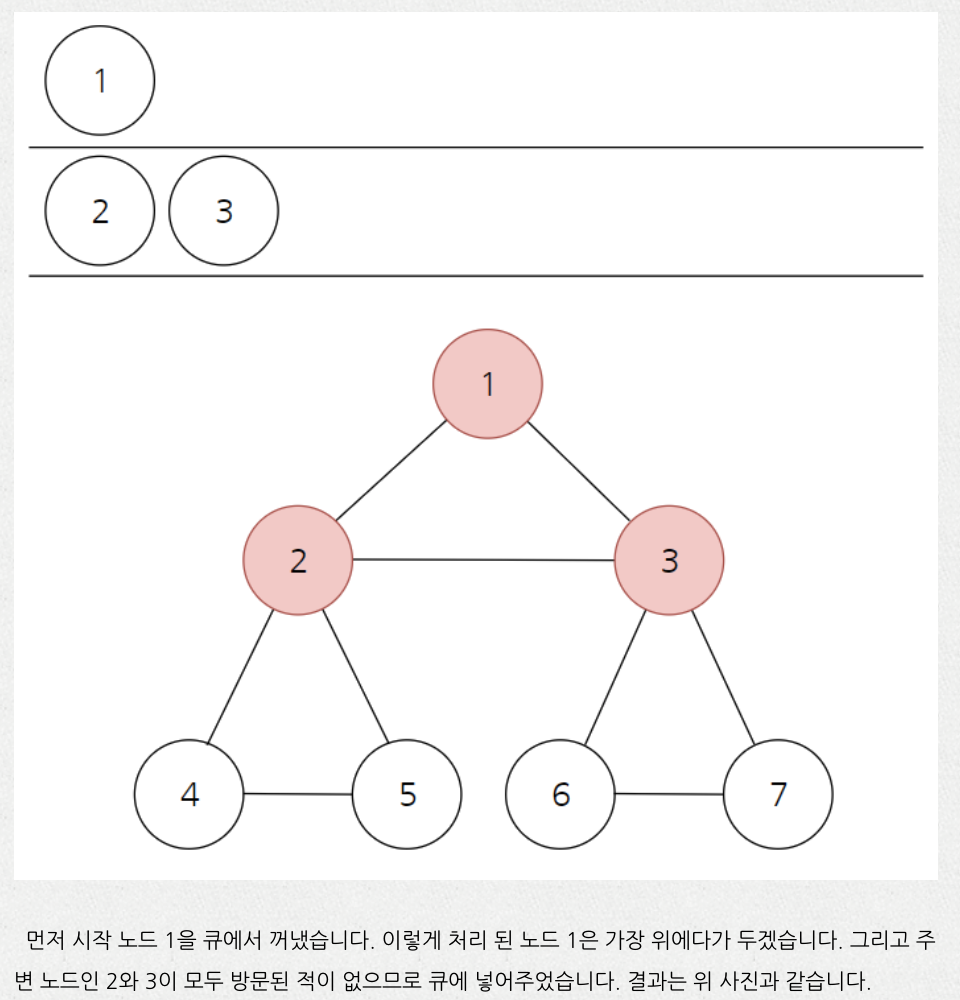
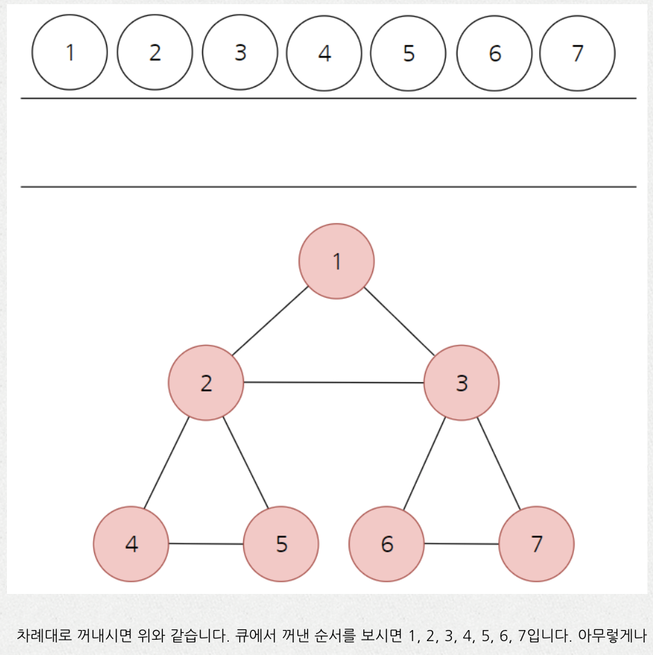

# **Breadth First Search (BFS) - Queue**

- **모든 드라마를 한편씩 챙겨봐야되는 알고리즘**
- **여러놈을 한대씩 때로고 가자.**
- **Queue / Linkedlist 씀 - 순서가 보장됨.**

: 탐색을 할 때 너비를 우선으로 하여 탐색을 수행하는 탐색 알고리즘.

`Breadth-First Search` is an algorithm **to traverse or search in data structures like a tree or a graph** . The algorithm starts with a root node and visit the node itself first. Then traverse its neighbors, traverse its second level neighbors, traverse its third level neighbors, so on and so forth.

When we do breadth-first search in a tree, the order of the nodes we visited is in level order.

> Breath_First Search 는 첫줄 먼저. 두째줄 → 셋째줄→ … 이런식으로 queue에 저장된다.

BST - QuickSort Connection

- Root is like a pivot
- Partitions elements into those smaller than pivot (left) and larger (right)
- Can sort by constructing BST and then using In-Order Traversal

