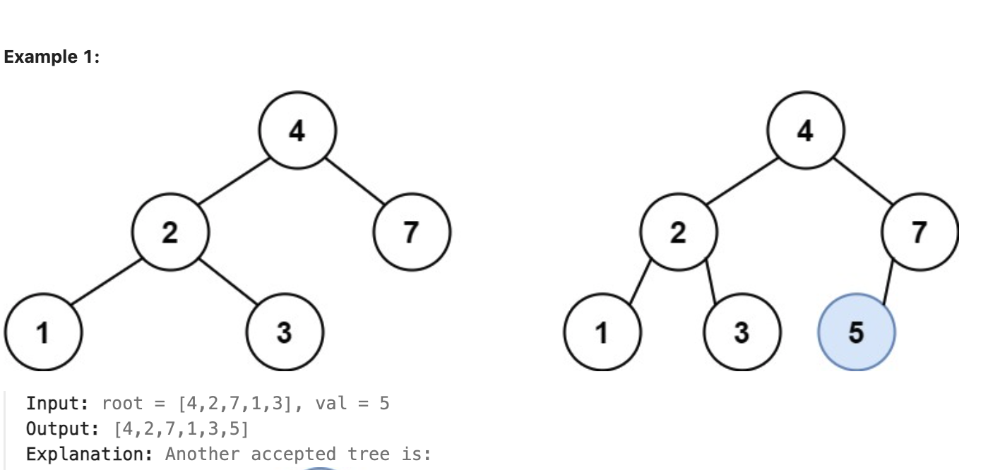
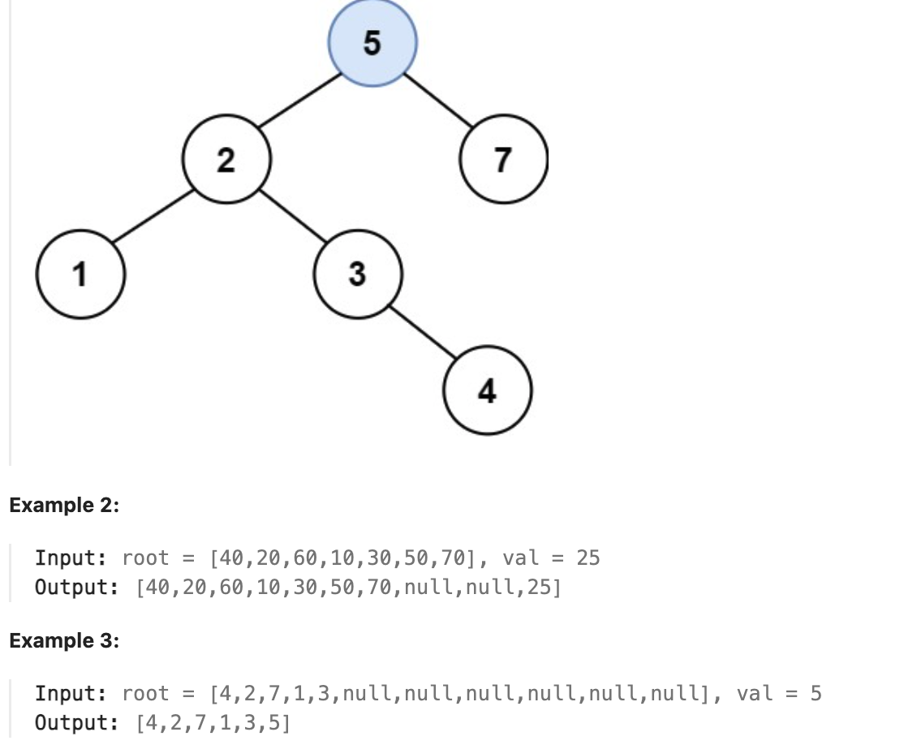

# [Insert into a Binary Search Tree](https://leetcode.com/problems/insert-into-a-binary-search-tree/) (Medium)

You are given the `root` node of a binary search tree (BST) and a `value` to insert into the tree. Return _the root node of the BST after the insertion_ . It is **guaranteed** that the new value does not exist in the original BST.

**Notice** that there may exist multiple valid ways for the insertion, as long as the tree remains a BST after insertion. You can return **any of them** .

