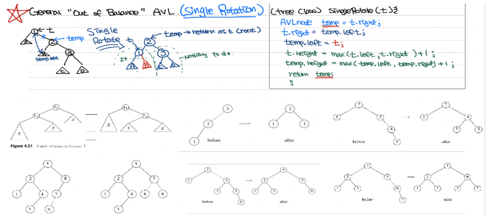

# AVL (ADELSON-VELSKY AND LONDIS)

**AVL (Adelson-Velsky and Landis)Tree**

* Original example of self-balancing binary search tree
* Developed by Georgy **A**delson-**V**elsky and Evgenii **L**andis in 1962
* Primary concept is that the height of LST and RST may differ by at most one
* That difference (+1, -1, or 0) is typically stored as part of each node
* Leads to both average and worst-case O(log n) time

