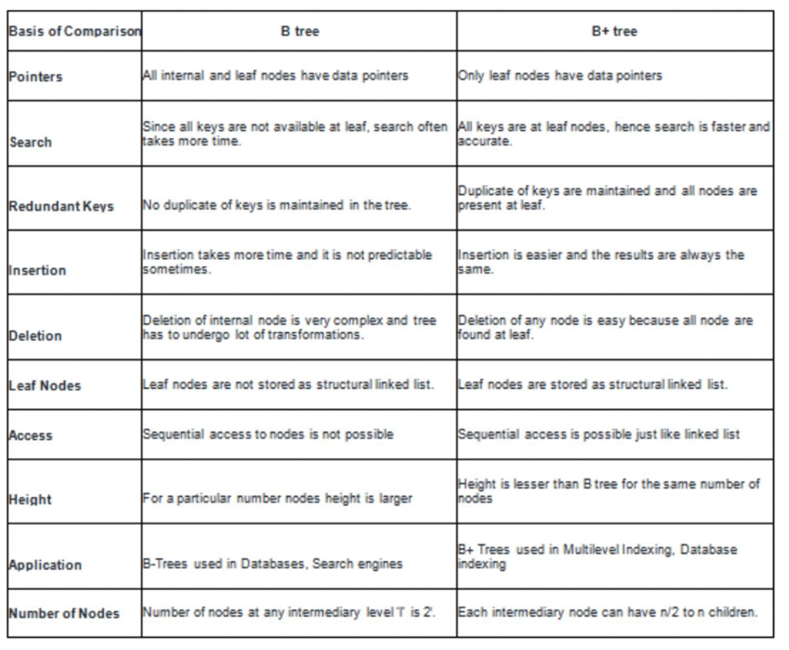
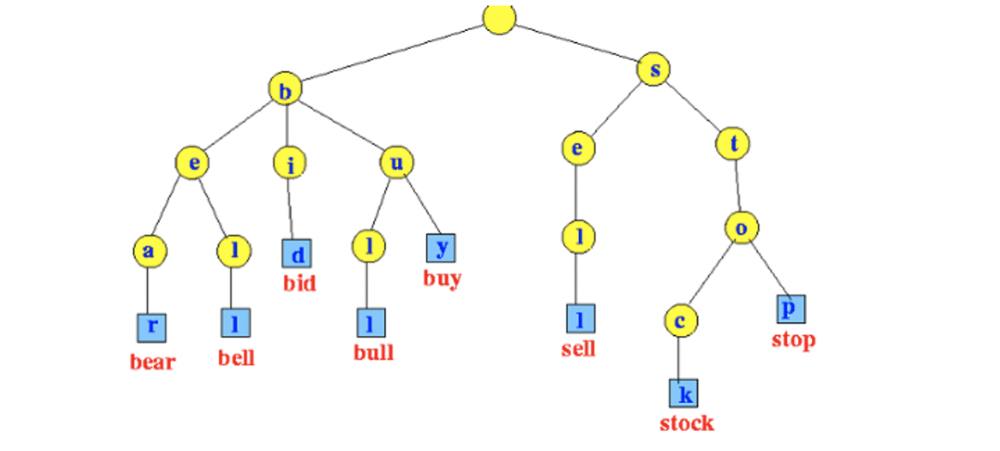
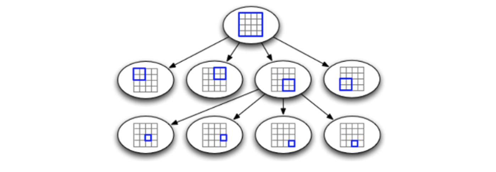
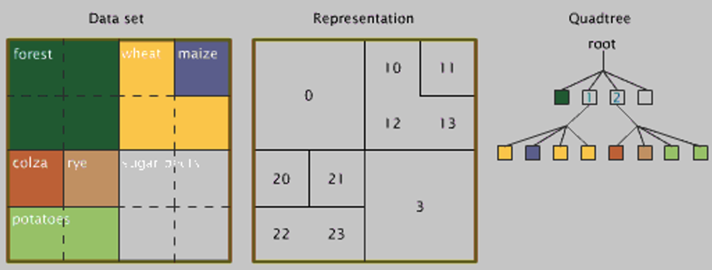

# **Red-Black Tree, B Tree, B+ Tree, Trie, Quad Tree**

## 1. **Red-Black Tree**

- Every node has a color either red or black
- The **root of the tree is always black**
- There are no two adjacent red nodes
  - A red node cannot have a red parent or red child
- Every path from a node (including root) to any of its descendants' NULL nodes has the same number of black nodes
- All leaf nodes are black nodes

## 2. B Tree

## 3. B+ Tree

## 4. Trie

- Based on the word “re**trie**val”, but pronounced like “try”
- Date back to 1959-60
- Like trees, based on nodes, keys, and links to nodes
- However, here the nodes are generally not entire keys, they are incremental
- Value associated with key is stored where that key terminates
  - May not necessarily be a leaf
- When navigating a patch, may return early if string cannot be there.

[Node Representation for a Trie]()

- Every node has one link per character in the alphabet
- The characters (that form the keys) are implicitly stored by link index
- Example from Sedgewick

## 6. **Quad Tree**

* Every (internal) node exactly four children
* Named a quadtree by Raphael Finkel and J.L. Bentley in 1974
* Sometimes used to partition a 2-D space into regions (quadrants)
* Each cell has a maximum capacity; if reached, the cell splits
* The leaves represents some item of spatial information
* Applications include image processing and range queries

