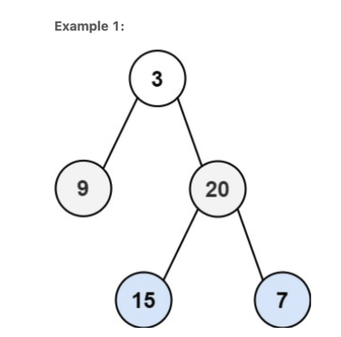
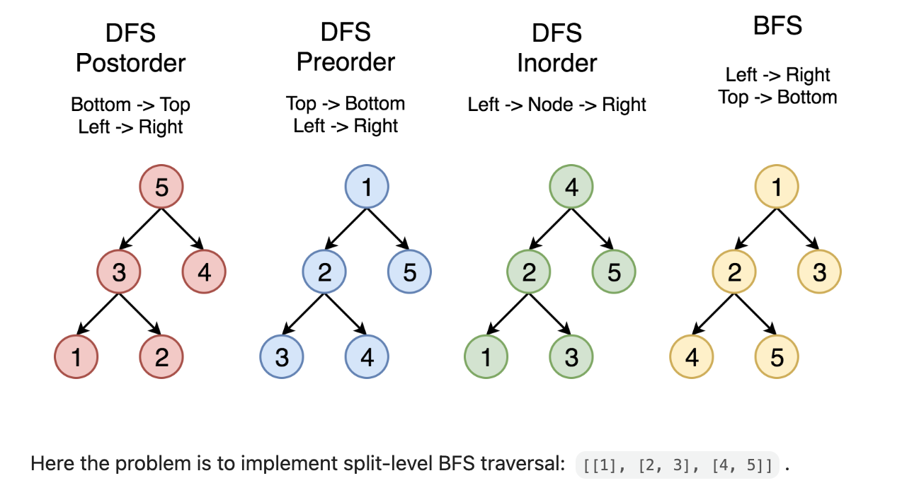

# **Binary Tree Level Order Traversal**



```
Input: root = [3,9,20,null,null,15,7]
Output: [[3],[9,20],[15,7]]
```

**Example 2:**

```
Input: root = [1]
Output: [[1]]
```

**Example 3:**

```
Input: root = []
Output: []
```

## How to traverse the tree

There are two general strategies to traverse a tree:

- _Depth First Search_ (`DFS`)
  In this strategy, we adopt `depth` as the priority, so that one would start from a root and reach all the way down to a certain leaf, and then back to root to reach another branch.
  The DFS strategy can further be distinguished as `preorder`, `inorder`, and `postorder` depending on the relative order among the root node, left node, and right node.
- _Breadth First Search_ (`BFS`)
  We scan through the tree level by level, following the order of height, from top to bottom. The nodes on higher levels would be visited before the ones with lower levels.

In the following figure, the nodes are enumerated in the order you visit them, please follow `1-2-3-4-5` to compare different strategies.



# Recursion

**Algorithm**

The simplest way to solve the problem is to use a recursion. Let's first ensure that the tree is not empty, and then call recursively the function `helper(node, level)`, which takes the current node and its level as the arguments.

This function does the following :

* The output list here is called `levels`, and hence the current level is just a length of this list `len(levels)`. Compare the number of a current level `len(levels)` with a node level `level`. If you're still on the previous level - add the new one by adding a new list into `levels`.
* Append the node value to the last list in `levels`.
* Process recursively child nodes if they are not `None`: `helper(node.left / node.right, level + 1)`.

## [Youtube](https://www.youtube.com/watch?v=6ZnyEApgFYg) video
