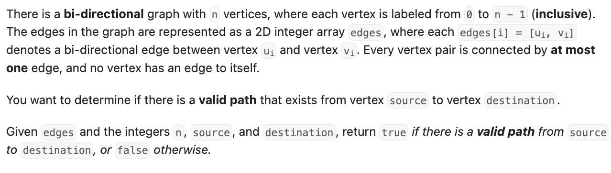
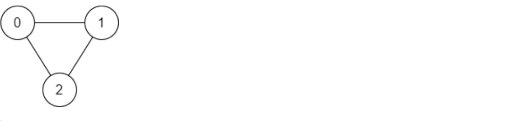
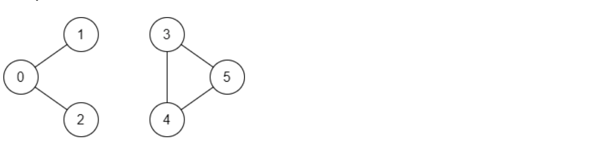
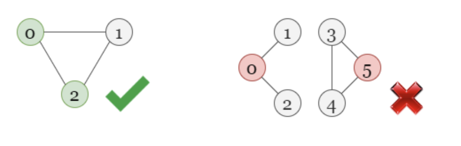
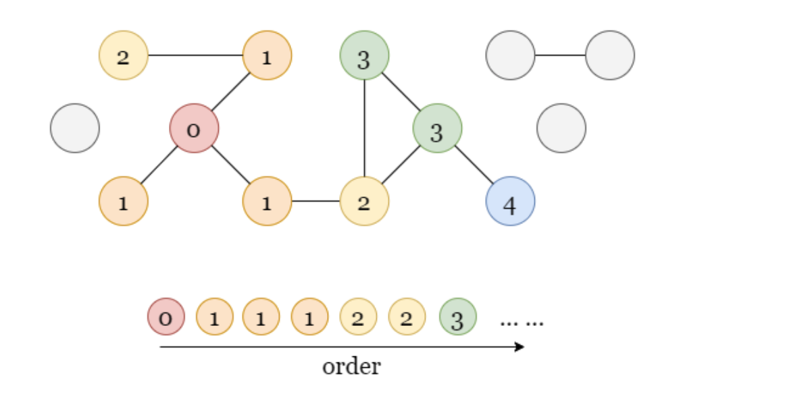
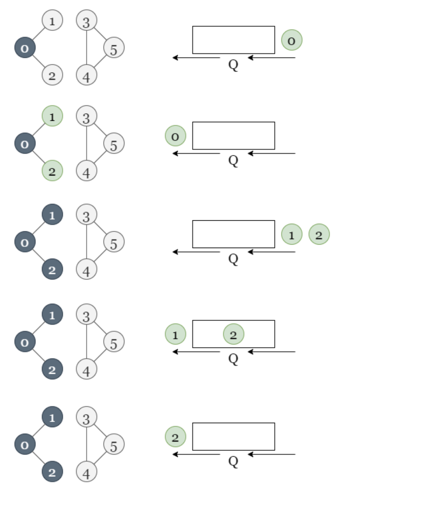
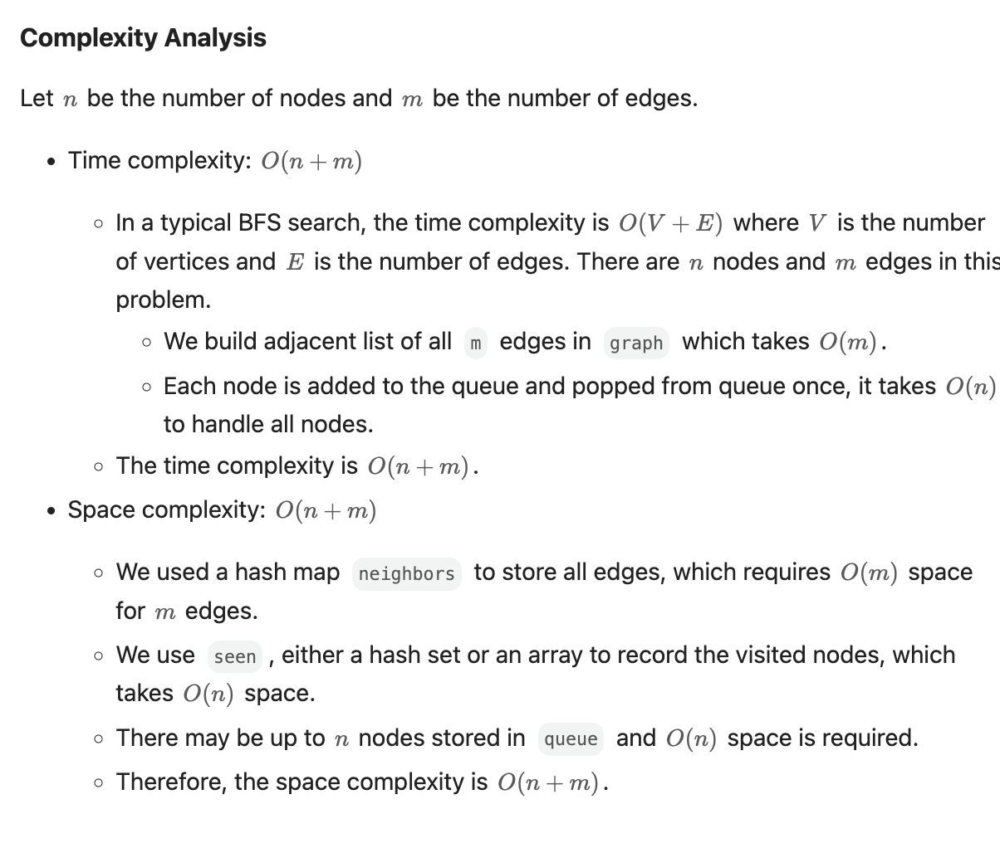
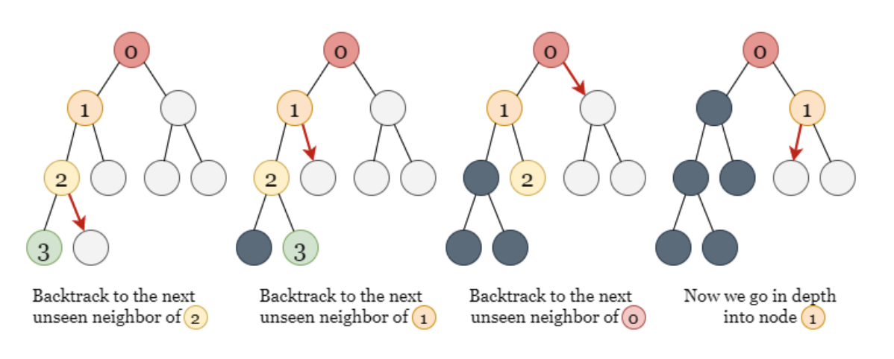
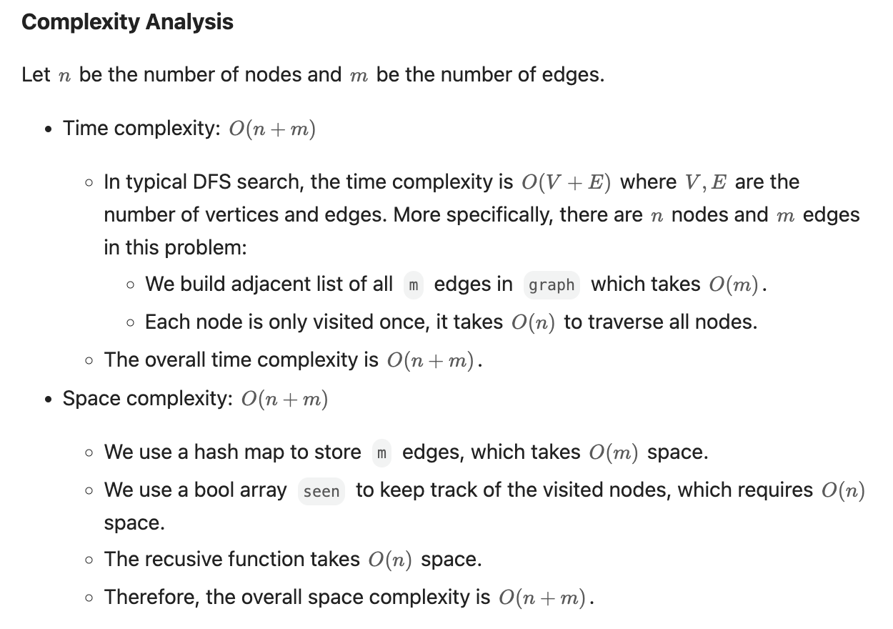

# [Find if Path Exists in Graph](https://leetcode.com/problems/find-if-path-exists-in-graph/)



**Example 1:**



<pre><strong>Input:</strong> n = 3, edges = [[0,1],[1,2],[2,0]], source = 0, destination = 2
<strong>Output:</strong> true
<strong>Explanation:</strong> There are two paths from vertex 0 to vertex 2:
- 0 → 1 → 2
- 0 → 2
</pre>

**Example 2:**



<pre><strong>Input:</strong> n = 6, edges = [[0,1],[0,2],[3,5],[5,4],[4,3]], source = 0, destination = 5
<strong>Output:</strong> false
<strong>Explanation:</strong> There is no path from vertex 0 to vertex 5.
</pre>

## Explanation

We are given a bi-directional graph in this problem, the task is: for the two nodes `source` and `destination` in this graph, we need to check if there exists a path from `source` to `destination`.



As shown in the pictures above:

- In the first graph, there exists a path from `0` to `2`.
- In the second graph, we can't find a path from `0` to `5`.

Now, we have to check if there exists a path between two given nodes. This hints to us that **this is a graph traversal problem** , where we have to start **traversal from one node and check if we can reach the other one.**
There exist two methods, breadth-first search (BFS) and depth-first search (DFS) for graph traversals.

One more thing to notice, as we have to check if there exists a path between two given nodes, this also hints that **two nodes must be connected** thus, this **problem can also be solved using Disjoint Set Union (DSU)** , where we check if both nodes belong to the same group (thus are connected via some path) or not.

Let's look at all these methods in detail one by one.

### Breadth First Search (BFS)

#### Intuition

If you are not much familiar with BFS traversal, we suggest you read our [Leetcode Explore Card](https://leetcode.com/explore/learn/card/queue-stack/231/practical-application-queue/) and have some knowledge of it beforehand!

In BFS, we explore the nodes in the order of their depth. Assuming that the starting node has a depth of `0`, we will explore all nodes at the present depth (`d`) before moving on to all nodes at the next depth (`d + 1`).

Here is an example of the order in which we visit the nodes using BFS, the starting node is colored in red and has a depth of `0`. The numbers stand for the depth of each node. Regardless of the specific structure, we always visit the node of `depth = 0`, then all nodes of `depth = 1`, all nodes of `depth = 2`, and so forth.



Back to this problem, we start with the node `source` with `depth = 0`, then we mark all its unvisited neighbor nodes with `depth = 1` to be visited soon, once we visit a node with `depth = 1`, we mark all its unvisited neighbor nodes with `depth = 2` as well.

We can use a queue `queue` as a container to store all nodes to be visited without mixing the order. Since the operation on the queue is done in First In, First Out (FIFO) order, so it allows us to explore all nodes with the current depth, before moving on to the nodes with larger depth!

Once we add a node to `queue`, we immediately mark it as **visited** to prevent it from being added to `queue` again by some other nodes later.

If we encounter the node `destination` during the process, it means that there exists a path from `source` to `destination`. Otherwise, it indicates that we can't find such a path.



As shown in the figure above, the node `0` is **visited** while the node `5` is **unvisited** . Thus there is no path from `0` to `5`.

#### Algorithm

1. Initialize an empty queue (`queue`) to store the nodes to be visited.
2. Use one bool array `seen` to mark all visited nodes and hash map `graph` to store all edges.
3. Add the starting node `0` to `queue` and mark it as **visited** .
4. If `queue` has nodes, get the first node `curr_node` from `queue`. Return `true` if `curr_node` is `destination`, otherwise, go to step 5.
5. Add all **unvisited** neighbor nodes of `curr_node` to `queue` and mark them as **visited** , then repeat step 4.
6. If we emptied `queue` without finding `destination`, return `false`.

```python
class Solution:
    def validPath(self, n: int, edges: List[List[int]], source: int, destination: int) -> bool:
        # Store all edges in 'graph'.
        graph = collections.defaultdict(list)
        for a, b in edges:
            graph[a].append(b)
            graph[b].append(a)

        # Store all the nodes to be visited in 'queue'.
        seen = [False] * n
        seen[source] = True
        queue = collections.deque([source])

        while queue:
            curr_node = queue.popleft()
            if curr_node == destination:
                return True

            # For all the neighbors of the current node, if we haven't visit it before,
            # add it to 'queue' and mark it as visited.
            for next_node in graph[curr_node]:
                if not seen[next_node]:
                    seen[next_node] = True
                    queue.append(next_node)

        return False
```



### Depth First Search (DFS): Recursive

#### Intuition

If you are new to Depth First Search, see our [Leetcode Explore Card](https://leetcode.com/explore/learn/card/queue-stack/232/practical-application-stack/) for more information on it!

In DFS, we explore nodes as far as possible along each branch. Upon reaching the end of the current branch, we backtrack to the next possible branch and continue exploring.



Once we encounter an unvisited node, we take one of its neighbor nodes (if it exists) as the next node on this branch. Recursively call the function to take the next node as the 'starting node' and solve the subproblem. If we reach the end of this branch, we backtrack to the previous node and visit the next neighbor node (if it exists), and repeat the process. Similarly, we also use a bool array `seen` to record every visited node, so they won't be visited by other nodes anymore.

#### Algorithm

1. Use one bool array `seen` to mark all visited nodes, set `seen[source] = true`.
2. Use a hash map `graph` to store all edges.
3. Start the search from node `source`. If the current node we are visiting (`curr_node`) equals `destination`, return `true`. Otherwise, find all its neighbor nodes that haven't been visited before.
   - If there exists such a neighbor node, mark it as visited, move on to this node and repeat step 3.
   - If this neighbor node can reach `destination`, then return `true`, otherwise, try the next neighbor.
4. Return `false` if we finished the search without finding `destination`.

```python
class Solution:
    def validPath(self, n: int, edges: List[List[int]], source: int, destination: int) -> bool:
        graph = collections.defaultdict(list)
        for a, b in edges:
            graph[a].append(b)
            graph[b].append(a)

        seen = [False] * n

        def dfs(curr_node):
            if curr_node == destination:
                return True
            if not seen[curr_node]:
                seen[curr_node] = True
                for next_node in graph[curr_node]:
                    if dfs(next_node):
                        return True
            return False

        return dfs(source)
```


