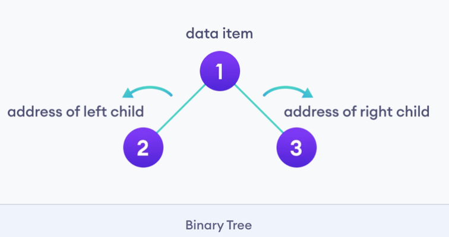
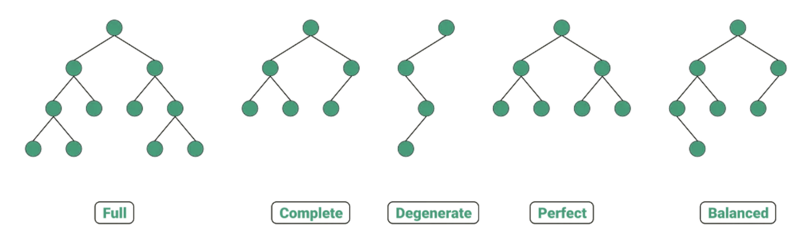
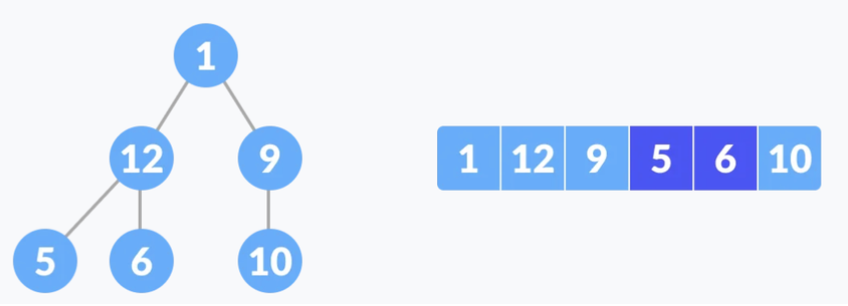
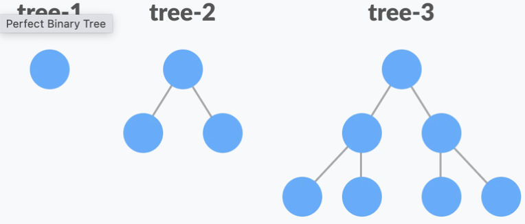
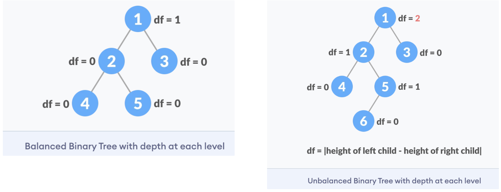

# Tree

A `tree` is an ADT representing a **hierarchical structure** with a **set of connected nodes** , each of which can be connected to _many_ children, but must be connected to exactly _one_ parent (except for the root node, which has no parent).

Each node of the tree will have a root value and a list of references to other nodes which are called **child nodes** . From graph view, a tree can also be defined as a directed acyclic graph which has `N nodes` and `N-1 edges`.

A `Binary Tree` is one of the most typical tree structure. As the name suggests, a binary tree is a tree data structure in which each node has `at most two children`, which are referred to as the left child and the right child.

## **Tree - Terminology**

- _Node_ (aka _Vertex_ ) - object that contains data and connections to other nodes
- Arc (aka _Edge_ , _Link_ , _Pointer_ ) - the connections between nodes
- _Internal Vertex_ - a node in the "middle" with one or more children
- _External Vertex_ (aka Leaf, Terminal Node) - a node at the bottom with no children
- _Neighbor_ - parent or child
- _Ancestor_ node reachable by repeatedly navigating upward from child to parent
- _Descendant_ _node_ reachable by repeatedly navigating downward from parent to child.
- _Degree of node_ the node's number of children (a leaf has degree zero)
- _Degree of tree -_ maximum degree of a node in the tree
- _Distance_ - the number of edges along the shortest path between two nodes.
- _Height_ - distance from the root to the furthest leaf (maximum distance)
- _Level_ the number of edges along the unique path between it and the root node.
- _Width_ - the number of nodes in a level
- _Breadth_ - the number of leaves in the tree
- _Size_ - number of nodes in the tree

## Binary tree 종류

- a tree with degree 2 (Ternary has degree 3, m-ary has degree m).

1. **Full Binary Tree**

- **Full Binary Tree** is a Binary Tree in which every node has 0 or 2 children.

2. **Complete Binary tree**

- **Complete Binary Tree** has all levels completely filled with nodes except the last level and in the last level, **all the nodes are as left side as possible.**
  

3. **Degenerate or Pathological Tree**

- A degenerate or pathological tree is the tree having a **single child** either left or right.

4. **Perfect Binary Tree**

- **Perfect Binary Tree** is a Binary Tree in which all internal nodes have 2 children and all the leaf nodes are at **the same depth or same level.**

  

5. **Balanced Binary Tree**

- It is a type of binary tree in which the difference between the height of the left and the right subtree for each node is either 0 or 1.

  

6. **Forest**

- a set of one or more **disjoint** trees (i.e. **no overlapping nodes or edges** )
  - technically this is not really a tree

7. **Ordered tree**

- rooted tree in which there is an ordering for the children of each vertex

