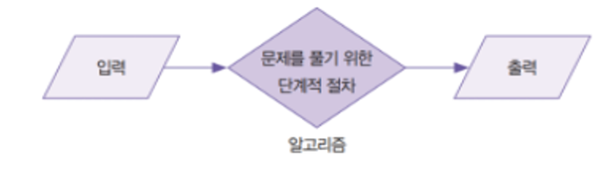
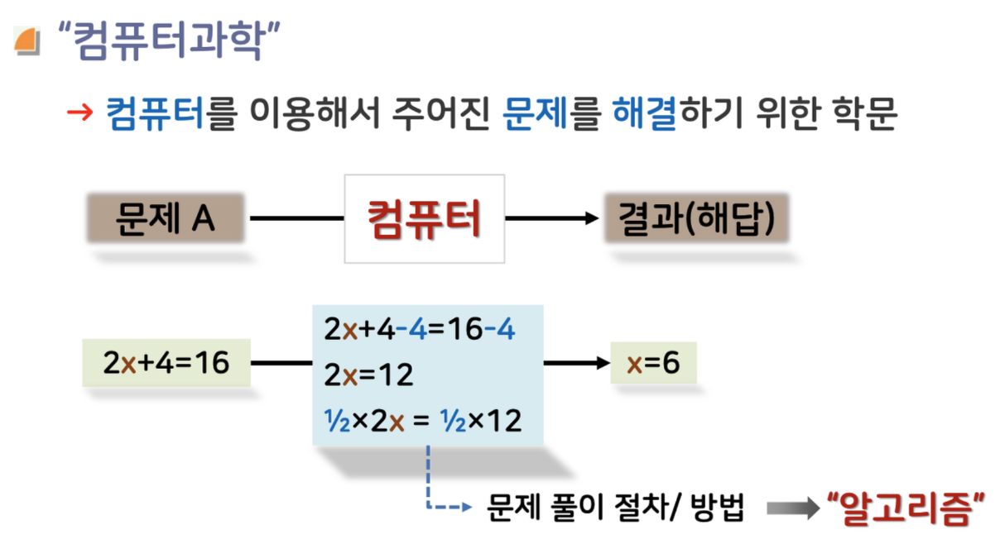

# Algorithm

## Algorithm이란?

: An algorithm is a **sequence of instructions** to solve a problem. 문제를 풀기 위한 여러가지의 지시사항.

**알고리즘**은 자료구조를 통해 저장된 데이터를 대상으로 어떤 문제의 해결 방법이다. 어떤 자료구조를 택하느냐에 따라 문제 해결을 위한 효율적인 접근이 달라지므로 알고리즘은 자료구조에 **의존적**이다.

### 실생활 알고리즘

아침에 일어나서 이불 정리 하고 씻고 운동복 입고 물 마시고 물 챙기고 챙길물건 챙기고 운동가기.

