# Algorithm 성능분석

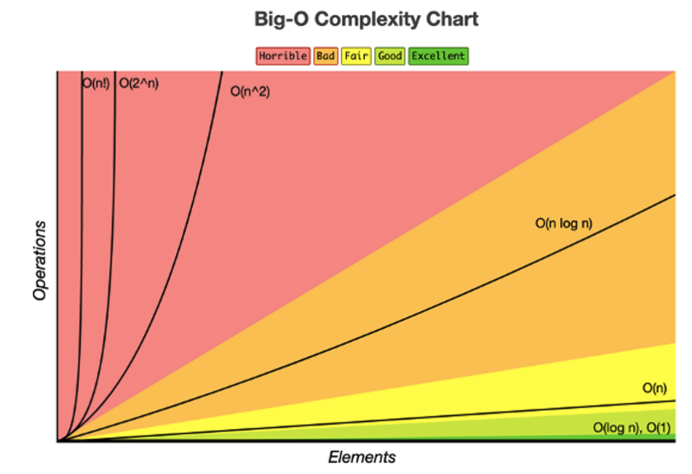

## 1. Time complexity and Space complexity

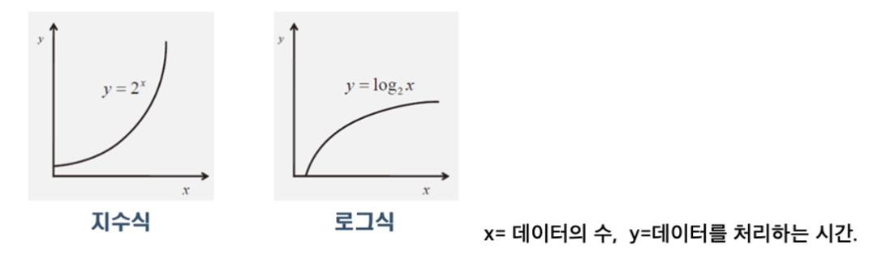

**Time Complexity 시간 복잡도** : 알고리즘의 **수행시간**을 평가. (CPU)

**Space Complexity 공간 복잡도** : 알고리즘 수행에 필요한 **메모리양**을 평가.

문제 해결을 위한 최적의 솔루션을 찾기 위해서는 자료구조와 알고리즘을 평가할 수 있어야한다. 일반적으로 알고리즘을 평가할 때 공간 복잡도보다는 **시간 복잡도에 초점**을 둔다. 공간 복잡도는 특정 알고리즘에 대한 상대적인 우월성을 입증하는 경우에 사용되기도 한다. 무조건적으로 연산 속도가 빠른 알고리즘을 선택하는 것이 아니라 자료의 갯수, 구현의 난이도와 같이 문제 해결 상황에 맞는 알고리즘을 선택해야한다.

- **최대한 빨리 끝나는게 쵝오지~ 느리면 짜증나잖아~**

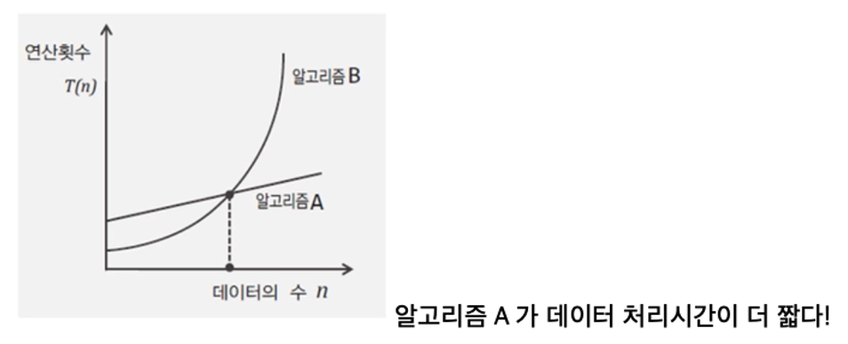

**Time Complexity**

- We often use T(n) to denote the time complexity (read: number of operations) of an algorithm, given an input of size n.
- Sometimes we further categorize as follows
  - **Tb(n)** - operations done by algorithm in **best case 최소 이만한 시간이 걸림**
    - Not helpful why: 99% we cannot get best case.
  - **TA(n)** - operations done by algorithm in **average case** (most difficult identifying an algorithim.) **평균**
  - **TW(n)** - operations done by algorithm in **worst case** .**최악. 즉 젤 오래 걸리는 시간ㅅ**

## 2. 시간 복잡도 계산 (빅오 표기법)

**: 데이터 수의 증가에 따른 연산횟수 증가율의 상한선을 표현한 것.**

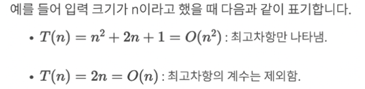

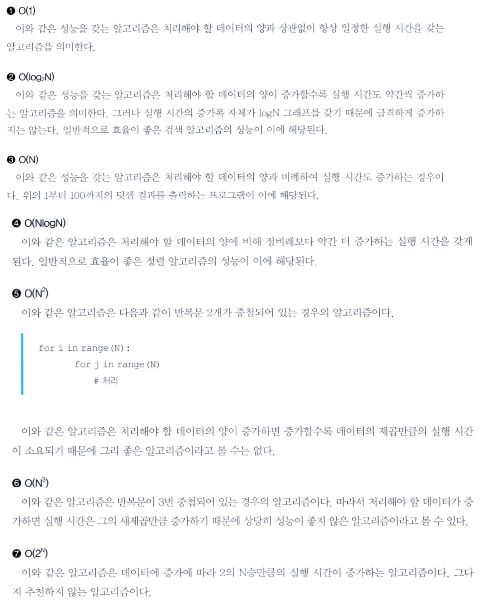

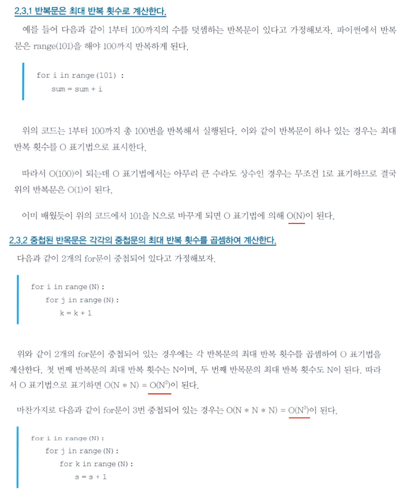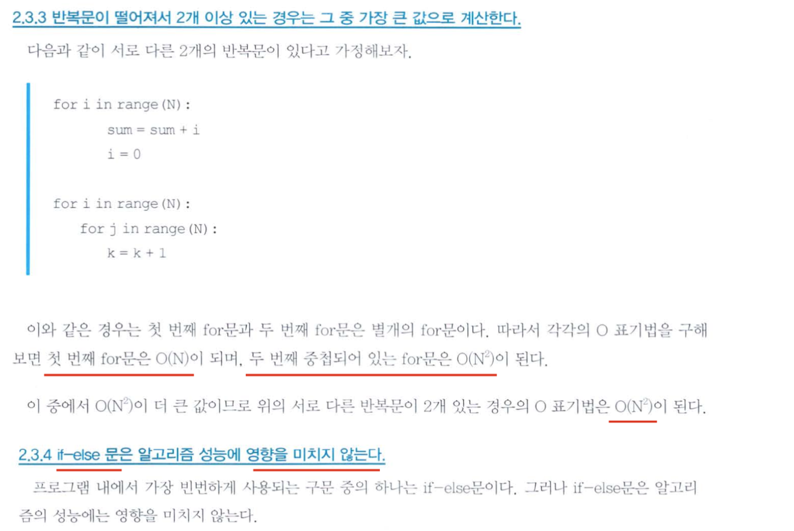

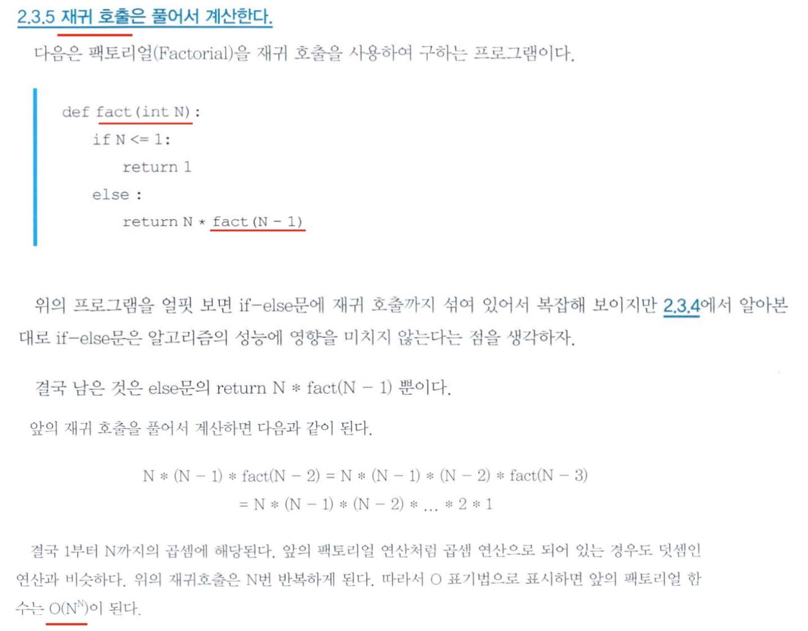

## 3. Binary Search 이진 탐색 알고리즘

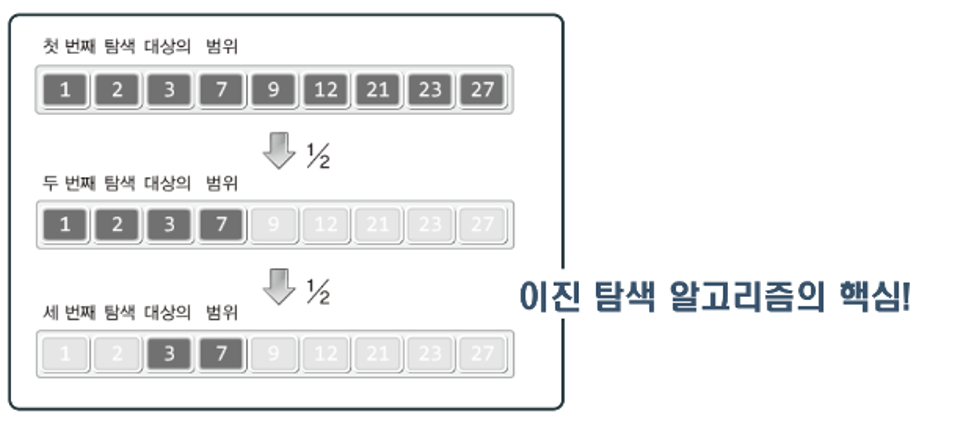

문제: 3이 어디에 저장 되어 있는가?

이진 탐색 알고리즘의 첫 번째 시도:

1. 배열 인덱스의 시작과 끝은 각각 0과 8이다.
2. 0과 8을 합하여 그 결과를 **2로 나눈다.** (0+8)/2 = 4 3. 2로 나눠서 얻은결과 4를 인덱스값으로 하여 arr[4]에 저장된 값이 3인지 확인!

이진 탐색 알고리즘의 두 번째 시도:

1. arr[4]에 저장된 값 9와 탐색 대상인 3의 대소를 비교한다.
2. 대소 비교결과는 arr[4]>3이므로 탐색 범위를 인덱스 기준 0~3으로 제한!
3. 0과3을 더하여그 결과를2로나눈다.이때 나머지는 버린다. 4. 2로 나눠서 얻은 결과가 1이니 arr[1]에 저장된 값이 3인지 확인한다.

이진 탐색 알고리즘의 세 번째 시도:

1. arr[1]에 저장된 값 2와 탐색 대상인 3의 대소를 비교한다.
2. 대소 비교결과 arr[1] < 3이므로 탐색의 범위를 읶인덱스 기준 2~3으로 제한!
3. 2와3을 더하여 그 결과를2로나눈다.이때 나머지는 버린다. 4. 2로 나눠서 얻은 결과가 2이니 arr[2]에 저장된 값이 3인지 확인한다. 3를 arr[2]에서 찾았다.

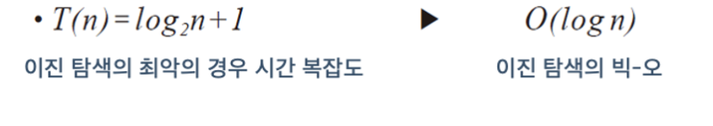

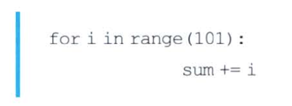

## 4. Complexity Classes - Grouping Functions by Θ(g(n))

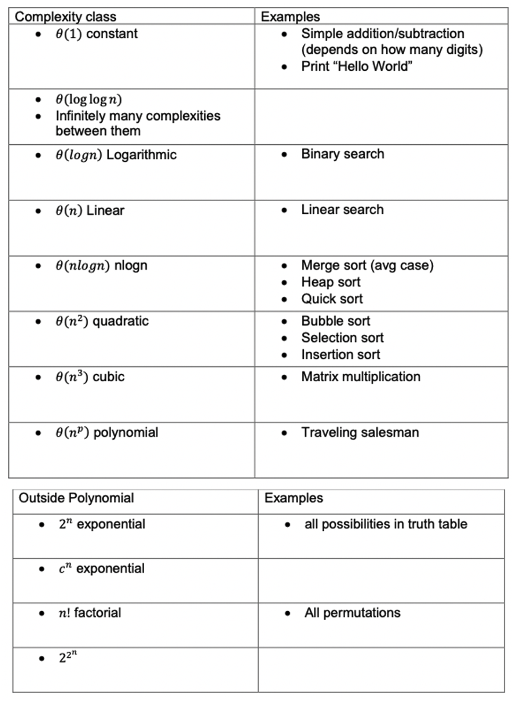
