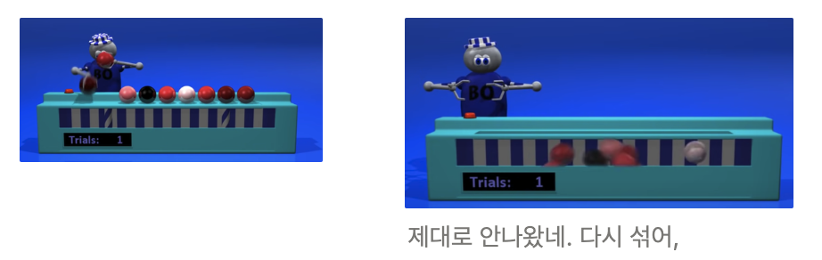
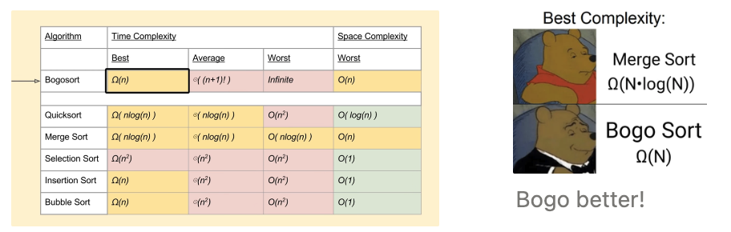

# 1. Bogo Sort

**: 무작위로 섞고 또 섞다가 맞아 떨어질때까지 섞음 (shaffle)**



## Bogo sort procedure

1. Create a random permutation of the data.
2. Check if the permutation is sorted.
3. If it is sorted, stop; otherwise repeat the whole process.



```python
import random

def bogo_sort(arr):
    def is_sorted(arr):
        for i in range(len(arr) - 1):
            if arr[i] > arr[i + 1]: # 현재 요소가 다음 요소보다 크다면
                return False        # (더 큰 숫자라면) False를 반환. 배열이 정렬되지 않았음. #while not is_sorted(arr)로 가기
        return True                 # 배열됨. goto return arr.

    while not is_sorted(arr):
        random.shuffle(arr)  # 배열을 무작위로 섞음. 다시 is_sorted(arr)로 가서 확인.

    return arr  # 정렬된 배열을 반환

to_sort = [5, 1, 12]
print(bogo_sort(to_sort))
```
