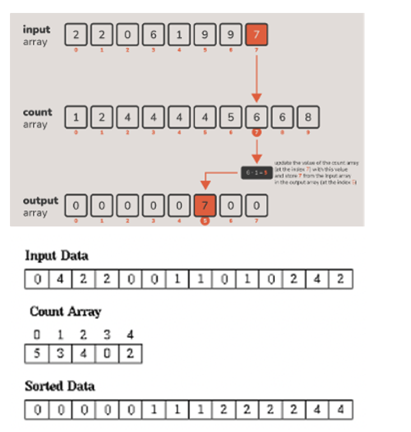

# 11. Counting Sort

* Initialize a frequency array to 0
  * There needs to be one cell for each possible value in range
* Count the frequency of each element in the input
* Output one copy of the number per each number in frequency
  * Example: if 5 has a frequency of four, output four 5’s
* You now have a sorted list
* Only works with integers in a fixed range
  * Map finite-precision floats to integers by multiplying by a power of ten

