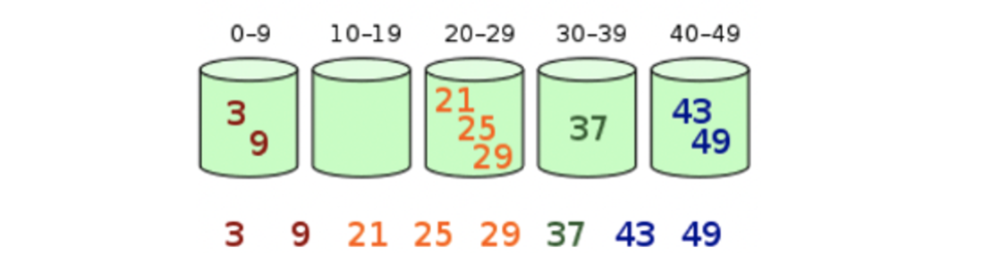

# 13. Bucket Sort

**버킷 정렬** 또는  **버킷 소트** (Bucket sort)는 수많은 버킷에 배열 요소들을 분산시킴으로써 동작하는 정렬 알고리즘이다 (통에 담듯이)

각 버킷은 그 뒤로 개별 정렬되는데, 이는 다른 정렬 알고리즘을 사용하거나 버킷 정렬 알고리즘을 반복 적용시켜 수행한다

버킷의 정렬은 다음과 같이 이루어진다.

1. 처음에 비어있는 버킷들의 배열을 배치한다
2. 분산 : 원래의 배열을 살펴보고 각 객체를 버킷에 담는다
3. 비어있지 않은 각 버킷을 정렬한다
4. 수집 : 순서대로 버킷을 방문하여 모든 요소를 원래의 배열에 위치시켜 놓는다.

* Create empty “buckets” that will respectively hold “slices” of data
  * Suppose we are sorting social security numbers
  * Bucket 0 will hold numbers beginning with 000 thru 099
  * Bucket 1 will hold numbers beginning with 100 thru 199
  * …
  * Bucket 9 will hold numbers beginning with 900 thru 999
* Place all data into buckets
* Sort each bucket
* Alternatively: place data into buckets in “sorted” order
  * Similar to Insertion Sort?
* Concatenate contents of each bucket
* Note that Bucket Sort (like Radix Sort) uses a hybrid of Comparison and Non-Comparison based techniques

