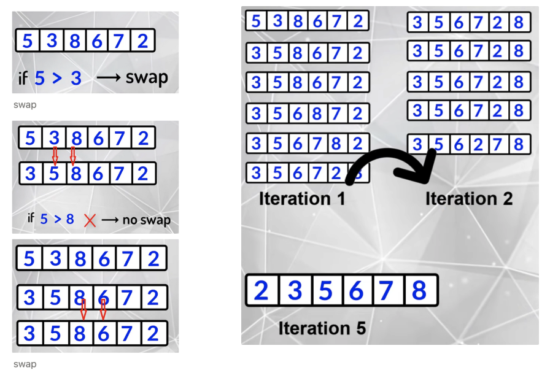
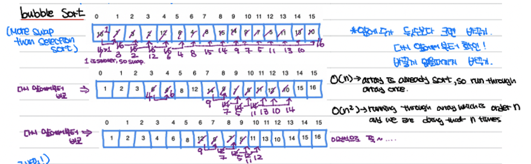

# 2. Bubble Sort (**Swapping)**





Outline

- Iterate through the array **swapping** any adjacent elements that are inverted
  - At this point, the largest element will now be in the last position
- Repeat this process, each time stopping one element earlier
- Popular optimization: if an iteration of the array finds no inversions, then the array is sorted at that point, and we can exist early
- Classification: Bubble Sort is an example of “Decrease and Conquer by one”.
- It may be implemented recursively of non-recursively

## Code

```python
def bubble_sort(nums):
    for i in range(len(nums)-1,0,-1): # (6-1)=5 , 반복문이 끝나는 지점을 뜻함. 0이 되면 끝남, -1은 i가 1씩 감소한다는 것이다.
                                        # i=0 (5,0,-1)                                     # i=1 (4,0,-1)
        for j in range(i):            # range(5)                                           # 4
            if nums[j] > nums[j+1] :  # 5 > 3      # 5 > 8  # 8 > 6  # 8 > 7  # 8 > 2      # 3>5 #5>6 #6>7 #7>2  #7>8
                # swapping
                temp = nums[j]         # temp = 5           # 8      # 8      # 8                           #7
                nums[j]= nums[j+1]     # 5 = 3              # 8 = 6  # 8 = 7  # 8 = 2                       #7=2
                nums[j+1] = temp       # 3 = temp           # 6      # 7      # 2                           #2
                                                                            #[3,5,6,7,2,8]                      #[3,5,6,2,7,8] ...
						    #한줄로 이렇게 써도 된다. nums[j], nums[j+1] = nums[j+1],nums[j]
    return nums

nums = [5,3,8,6,7,2]
sorted_nums = bubble_sort(nums)
print(sorted_nums)
```

[2, 3, 5, 6, 7, 8]
