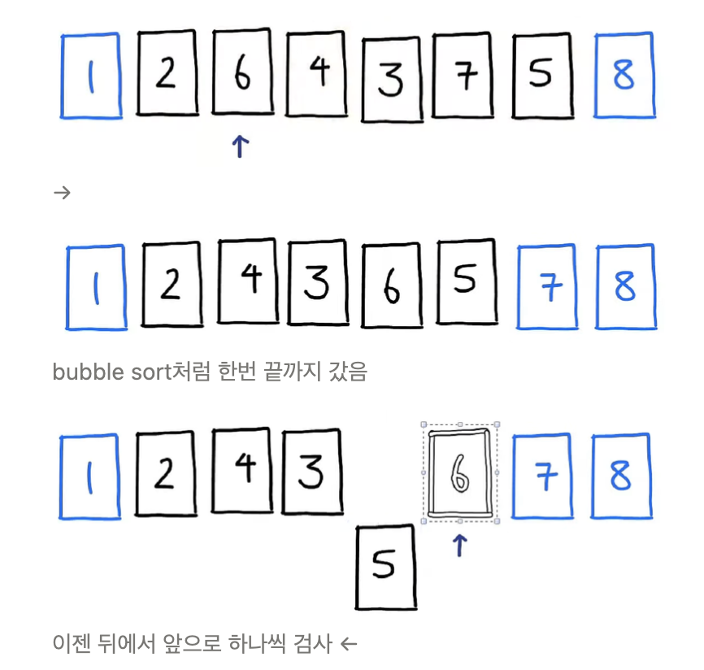
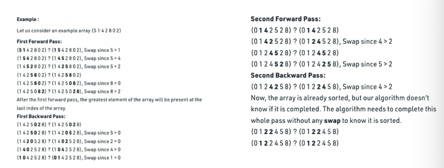

# 3. Cocktail Sort

: Cocktail sort is a variation of Bubble sort

: 앞에서부터 하나씩 큰수를 뒤로 보내고 다 보낸후. 다시 뒤에서부터 앞으로 체크하면서 온다. 그럼 다시 앞에서 끝까지. 끝에서 앞으로. 그렇게 모든 숫자가 정렬이 될때까지 반복된다.

## Cocktail Sort: Overview

- Similar to Bubble Sort, but works in **both directions**
- Moves largest to last position, by swapping adjacent elements (L to R)
- Moves smallest to first position, by swapping adjacent elements (R to L)
- Now first and last no longer need to be considered
- Repeat with array positions 1 thru n-2 (instead of positions 0 thru n-1)
- Use the optimization that if there are no swaps in an iteration of the outer loop, then we can exit early
- Time complexity similar to Bubble Sort

