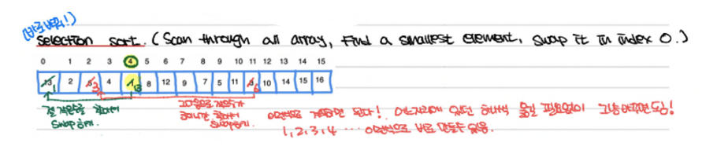

# 4. Selection Sort

: **작은수부터** **자리** **옮기기!**

**Not stable.** However it can be made stable

## Outline

* Find the index of the smallest element of the unsorted portion
* Swap the smallest with the current position
  * That element is now in its final place
* Repeat this process, starting with the next position

Note that there is only one swap per iteration (in contrast to Bubble Sort)!

Classification: Selection Sort uses “Decrease and Conquer (by one)”.

It may be implemented recursively or non-recursively



[Youtube](https://www.youtube.com/watch?v=g-PGLbMth_g&t=39s)

## Code

```python
# Selection sort in Python
# time complexity O(n*n)

def selectionSort(array, size):              
    for i in range(size):       #i=0 in range(6)                                                 # i=1
        min_index = i           # -1 이 min_index
        for j in range(i + 1, size):    # 1 (15, 6)   # 2 (7, 6)  # 3 (2, 6)  # 4 (-5, 6)  # 5 (10, 6)
            # select the minimum element in every iteration
            if array[j] < array[min_index]: # 15 < -1  # 7 < -1    # 2 < -1    # -5 < -1    # 10 < -1
                min_index = j                                                  # min_index = -5
        # swapping the elements to sort the array
        (array[i], array[min_index]) = (array[min_index], array[i])            #(-1,-5) = (-5,-1)
                                                                               #[-5,15,7,2,-1,10]
arr = [-1,15,7,2,-5,10]
size = len(arr)             # def selectionSort(array): 하고 이 함수 안에 써도 된다. 그럼 selectionSort(array)가 됨.
selectionSort(arr, size)
print(arr)
```

시간 복잡도(Time Complexity):
선택 정렬의 시간 복잡도는 **O(n^2)**입니다. 외부 루프는 배열의 모든 요소에 대해 반복하고, 내부 루프는 외부 루프의 현재 인덱스 이후의 요소들과 비교하여 최솟값을 찾기 때문에 이중 반복문이 사용됩니다.

공간 복잡도(Space Complexity):
이 구현에서는 추가적인 공간이 사용되지 않습니다. 따라서 공간 복잡도는 **O(1)**입니다. 추가적인 배열 또는 데이터 구조를 사용하지 않고 입력 배열 내에서 요소의 위치를 변경하여 정렬을 수행합니다.
