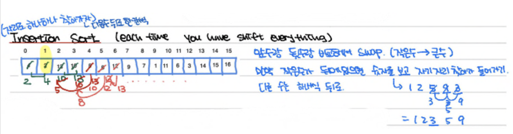
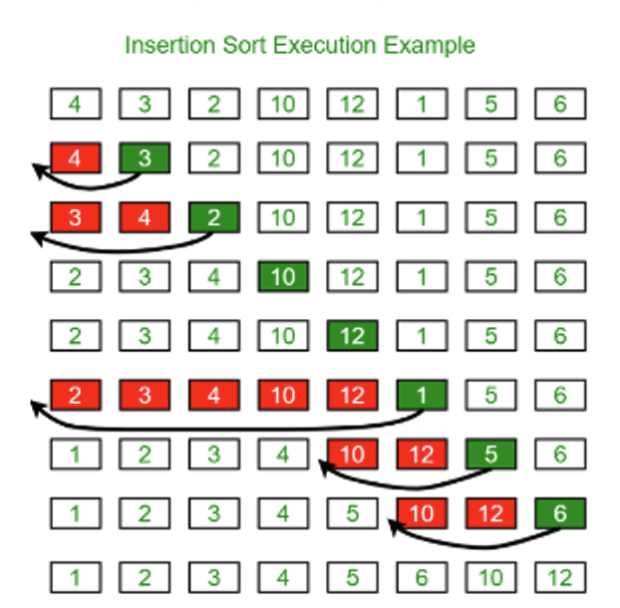

# 5. Insertion Sort

## Outline

- Array is divided into sorted portion (left) and unsorted portion (right)
  - Initially, sorted portion has one element and unsorted has n-1 elements
- At each iteration, take the first element from the unsorted portion and find the correct place to “insert” it in the sorted portion
  - As we iterate to find the correct place, we need to move elements to the left to make room

Possible optimization: use Binary Search instead of Linear Search to find the point of insertion.

