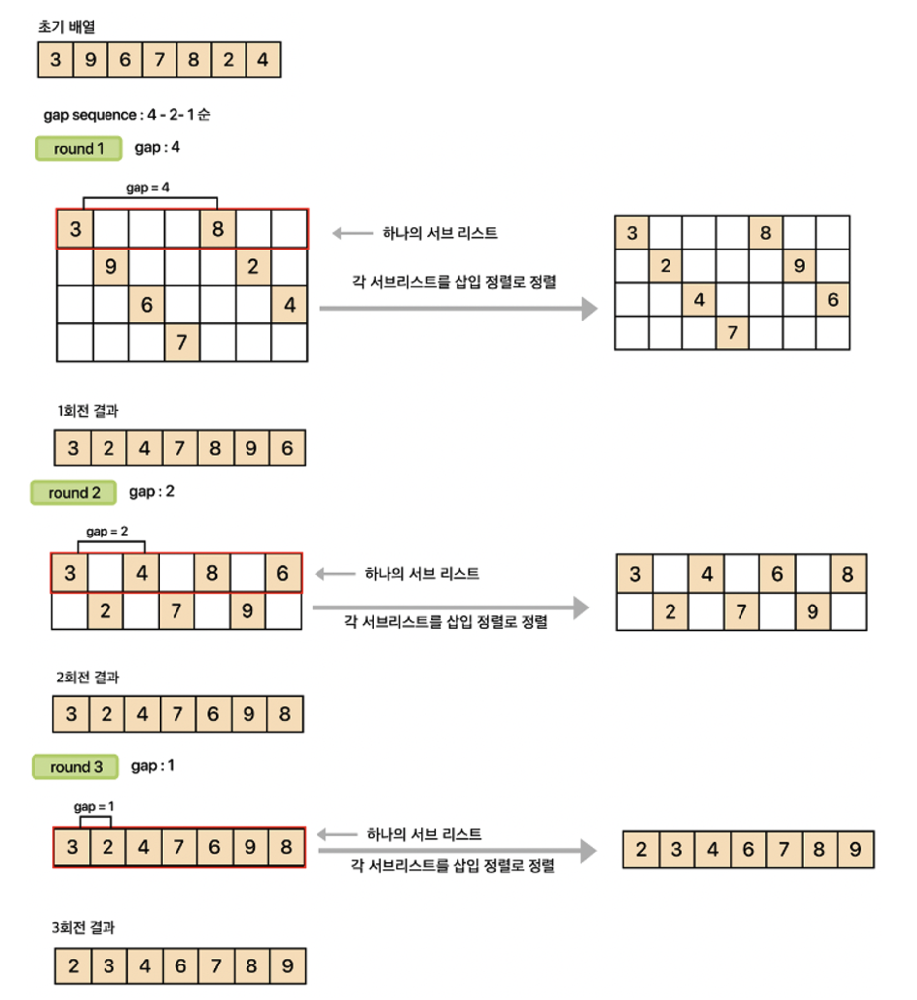

# 6. Shell Sort

: Is mainly a variable of insertion sort

Analysis is very difficult

* Depends on the optimal gaps and other considerations

셸 정렬의 전체적인 과정은 이렇다. (오름차순을 기준으로 설명)

1. **간격(gap)을 설정한다.**
2. **각 간격별로 분류 된 서브(부분) 리스트에 대해 삽입정렬을 한다.**
3. **각 서브(부분) 리스트의 정렬이 끝나면 간격을 줄인다.**
4. **간격이 1이 될 때 까지 2번 과정으로 되돌아가며 반복한다.**

