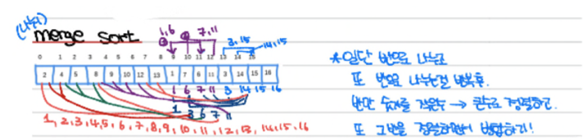
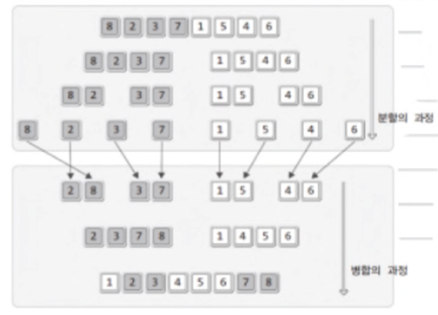

# 7. Merge Sort

* Classic example of a “Divide and Conquer” algorithm
* Divide the array into two (roughly) equal parts
  * “left” thru “mid” and “mid+1” thru “right”
* Recursively sort each “half” using Merge Sort
* Merge the two “halves” by comparing the two foremost elements in each list and copying the smaller one to an auxiliary array

Note that Merge Sort, as traditionally implemented above, is “out-of-place” (uses auxiliary storage)

