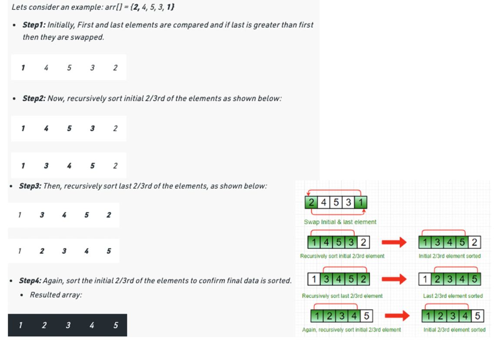

# Stooge Sort(2/3)

Step 1 : If value at index 0 is greater than value at last index, swap them.
Step 2:  Recursively,
    a) Stooge sort the initial 2/3rd of the array.
    b) Stooge sort the last 2/3rd of the array.
    c) Stooge sort the initial 2/3rd again to confirm.
