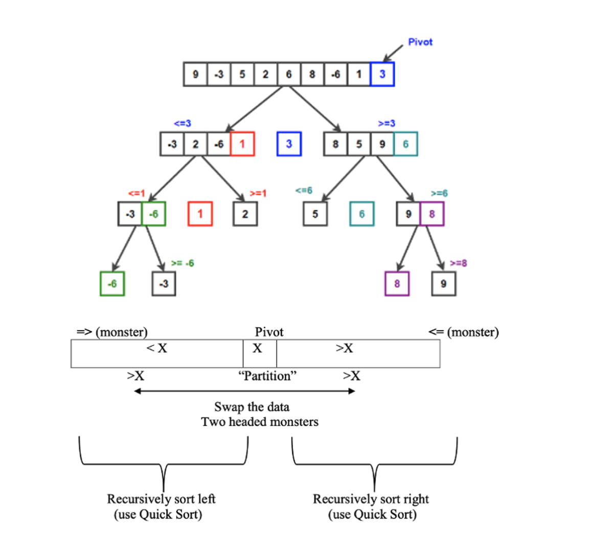

# **9. Q**uick Sort

Quick Sort (a [Divide and Conquer algorithm](https://www.geeksforgeeks.org/divide-and-conquer-algorithm-introduction/). Merge sort랑 비슷해)

* Choose a “pivot” element X in position k
  * Ideally this pivot will approximate the median (50%-ile)
  * How to choose the pivot?
    * Median of three (first, middle, last)
    * Randomized approach




```python
// low  --> Starting index,
// high  --> Ending index
quickSort(arr[], low, high) {

  // Till starting index is lesser than ending index
  if (low < high) {

    // pi is partitioning index,
    // arr[p] is now at right place
    pi = partition(arr, low, high);

    // Before pi
    quickSort(arr, low, pi - 1);
    // After pi
    quickSort(arr, pi + 1, high);
  }
}
```
