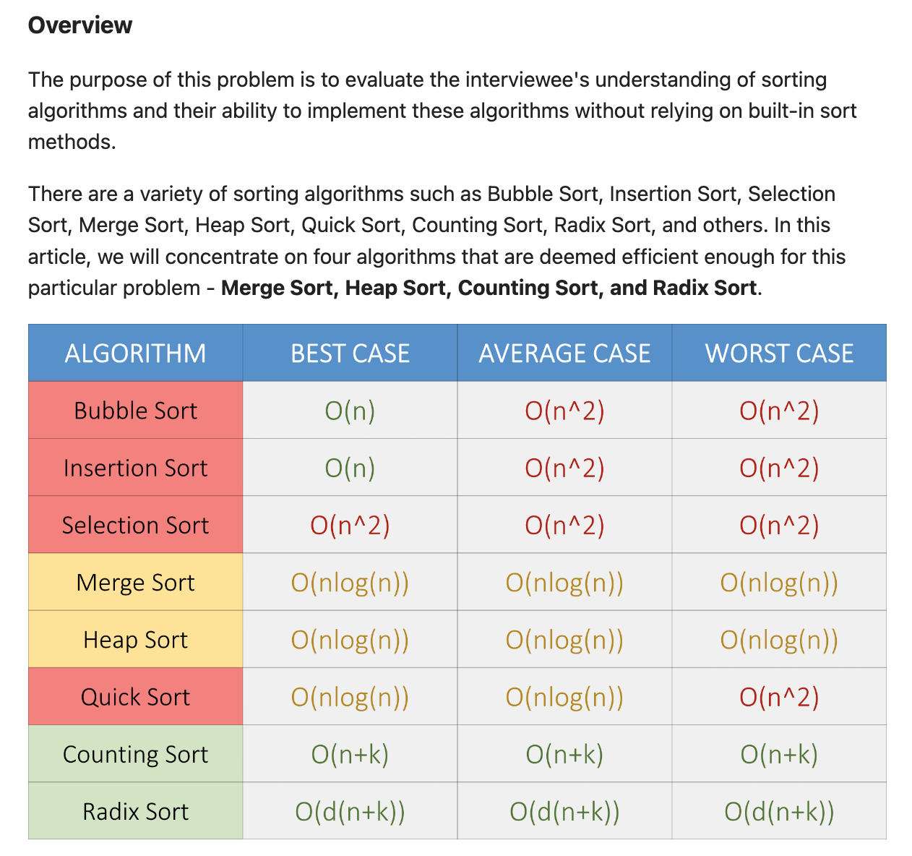
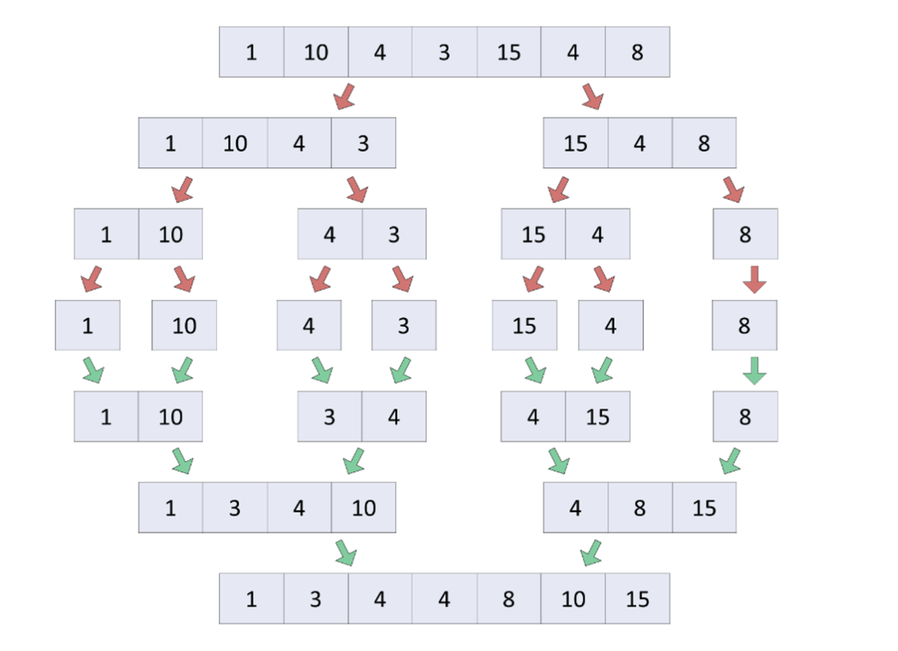

# **[912. Sort an Array](https://leetcode.com/problems/sort-an-array/) (Medium)**

Given an array of integers `nums`, sort the array in ascending order and return it.

You must solve the problem **without using any built-in** functions in `O(nlog(n))` time complexity and with the smallest space complexity possible.

**Example 1:**

```
Input: nums = [5,2,3,1]
Output: [1,2,3,5]
Explanation: After sorting the array, the positions of some numbers are not changed (for example, 2 and 3), while the positions of other numbers are changed (for example, 1 and 5).
```

**Example 2:**

```
Input: nums = [5,1,1,2,0,0]
Output: [0,0,1,1,2,5]
Explanation: Note that the values of nums are not necessairly unique.
```

**Constraints:**

* `1 <= nums.length <= 5 * 104`
* `5 * 104 <= nums[i] <= 5 * 104`

# Solution



## **Approach 1: Bubble Sort**

: This program sorts the list by looping through the original list and finding any adjacent pairs of numbers that are out of order. If it finds such a pair, it switches their locations. It continues to check for adjacent pairs that are out of order until it has completed the pass through the list. If it finds a pair, it will set B = 1 which tells the program to pass through the list again and continue switching adjacent values that are out of order. If it can make it through the list without finding any adjacent pairs that are out of order, we can conclude that the list is sorted. The value of B will stay 0 and the outer while loop will end. This algorithm is O(n²). It is able to sort 8 out of 10 test cases but exceeds the time limit on the ninth test case.

```python
class Solution:
    def sortArray(self, nums: List[int]) -> List[int]:
        L, B = len(nums), 1  # B 변수는 후에 반복문을 통해 정렬이 완료되었는지를 나타내는 플래그 역할을 합니다.
        while B:  # 반복문은 B 변수가 0이 될 때까지 실행됩니다. 초기에 B는 1로 설정되어 있으므로 최초에는 반드시 한 번 실행됩니다.
            B = 0 # 반복문이 시작될 때마다 B 변수를 0으로 초기화합니다. 이렇게 하면 이후에 정렬 작업이 한 번도 수행되지 않으면 루프가 종료됩니다.
            for i in range(L-1):
								# switch
                if nums[i] > nums[i+1]: nums[i], nums[i+1], B = nums[i+1], nums[i], 1
        return nums
```

```python
'''
Input: nums = [5,2,3,1]
Output: [1,2,3,5]
'''

class Solution:
    def sortArray(self, nums: List[int]) -> List[int]:
        L, B = len(nums), 1  # L = 4, B = 1
        while B:             # B = 1
            B = 0 
            for i in range(L-1):  # i = 0부터 L-2까지.   # i = 1    # i=2                   
                if nums[i] > nums[i+1]: nums[i], nums[i+1], B = nums[i+1], nums[i], 1
                # i = 0
                #     5   >    2      :   5    ,    2     , B =    2     , 5      , 1  
                #    => [2,5,3,1]이고 B가 1로 설정되어 정렬이 아직 완료되지 않았음을 나타낸다.
                # i = 1 
                #     5   >    3      :   5    ,    3     , B =    3     , 5      , 1
                #    =>  [2,3,5,1]  이고 B가 1로 설정되어 정렬이 아직 완료되지 않았음을 나타낸다.
                # i=2 
                #     5   >    1      :   5    ,    1     , B =    1     , 5      , 1
                #    =>  [2,3,1,5]  이고 B가 1로 설정되어 정렬이 아직 완료되지 않았음을 나타낸다.
                # 더이상 교환이 없으므로 for loop 나와서 다시 while loop. 반복하기. 
        return nums # [1,2,3,5]
```

## **Approach2 : Selection Sort**

```python
class Solution:
    def sortArray(self, nums: List[int]) -> List[int]:
        L = len(nums)
        return [nums.pop(min(range(L-i), key = lambda x: nums[x])) for i in range(L)]
```

1. 이 부분은 리스트 컴프리헨션(List Comprehension)을 사용하여 정렬된 새로운 리스트를 생성하고 반환하는 부분입니다. 선택 정렬 알고리즘을 사용하여 리스트를 정렬합니다.
2. **`range(L)`**에서 **`i`** 값을 반복하면서 리스트를 정렬합니다. **`i`**는 0부터 **`L-1`**까지 증가합니다.
3. **`min(range(L-i), key = lambda x: nums[x])`**를 사용하여 현재 남은 요소 중에서 가장 작은 값을 가진 요소의 인덱스를 찾습니다. 이때 **`min`** 함수의 **`key`** 인수를 활용하여 **`nums`** 리스트 내의 요소를 비교하고 가장 작은 값을 가진 인덱스를 찾습니다.
4. **`nums.pop(...)`**를 사용하여 찾은 가장 작은 값을 가진 요소를 **`nums`** 리스트에서 제거하고 반환합니다. 이렇게 하면 선택된 가장 작은 값이 결과 리스트에 추가됩니다.
5. 반복문이 모두 실행되면, 정렬이 완료되어 새로운 리스트가 반환됩니다.

## **Approach 3: Insertion Sort**

```python
class Solution:
    def sortArray(self, nums: List[int]) -> List[int]:
        L = len(nums)
        for i in range(1,L):     # i = 1, range(1,4) 즉 i는 1, 2, 3까지 반복됩니다.  # i =2                                       # i=3        
            for j in range(0,i): # j = 0, range(0,1)                            # j=0, range(0,2)        # j = 1             # j=0 range(0,3)    #j=1               # j=2               j=3
                if nums[i] < nums[j]: # 2 < 5                                   # nums[2]= 3 < nums[0]=2 # 3 < 5             # 1 < 2             # 2 < 3            # 5 < 3             # 5 <5
                    nums.insert(j, nums.pop(i))                                                          # 3제거. j위치에 3삽입. # 1제거, j위치에 1삽입. # 2제거, j위치에 2삽입.# 5제거, j위치에 5삽입.   
                    #nums.pop(i)를 통해 nums[1]의 2를 제거하고, j 위치에 2를 삽입. nums는 [2, 5, 3, 1]로 변경      # [2,3,5,1]          #[1,3,5,2]          #[1,2,5,3]         # [1,2,3,5]
                    break # break 문장을 사용하여 이미 정렬된 부분에서는 비교와 삽입 작업을 최적화하고 불필요한 반복을 방지합니다.
        return nums		                                                                                                                                                                # [1,2,3,5]
```


## **Approach4 :** Binary Insertion Sort

```python
'''
Input: nums = [5,2,3,1]
Output: [1,2,3,5]
'''
import bisect

class Solution:
    def sortArray(self, nums: List[int]) -> List[int]:
        L = len(nums)   # L = 4
        for i in range(1,L): bisect.insort_left(nums, nums.pop(i), 0, i) 
        # for i in range(1, L):에서 i는 1, 2, 3까지 반복
        # (i = 1): nums[1]인 2를 이진 삽입 정렬로 적절한 위치로 삽입합니다. 현재까지의 리스트는 [5, 2, 3, 1]에서 [2, 5, 3, 1]로 변경됩니다.
        # (i = 2): nums[2]인 3을 이진 삽입 정렬로 적절한 위치로 삽입합니다. 현재까지의 리스트는 [2, 5, 3, 1]에서 [2, 3, 5, 1]로 변경됩니다.
        # (i = 3): nums[3]인 1을 이진 삽입 정렬로 적절한 위치로 삽입합니다. 현재까지의 리스트는 [2, 3, 5, 1]에서 [1, 2, 3, 5]로 변경됩니다.
        # 루프 종료
        return nums  # [1, 2, 3, 5]가 반환
```

### **bisect**

1. **`bisect.bisect_left(a, x, lo=0, hi=len(a))`** : 정렬된 시퀀스 **`a`**에서 값 **`x`**를 찾고, 삽입할 위치의 인덱스를 반환합니다. 만약 **`x`**가 이미 시퀀스 안에 존재한다면, **`x`**의 왼쪽에 위치한 인덱스를 반환합니다.
2. **`bisect.bisect_right(a, x, lo=0, hi=len(a))`** : 정렬된 시퀀스 **`a`**에서 값 **`x`**를 찾고, 삽입할 위치의 인덱스를 반환합니다. 만약 **`x`**가 이미 시퀀스 안에 존재한다면, **`x`**의 오른쪽에 위치한 인덱스를 반환합니다.
3. **`bisect.insort_left(a, x, lo=0, hi=len(a))`** : 정렬된 시퀀스 **`a`**에 값을 삽입합니다. 이 함수는 **`bisect.bisect_left()`**를 사용하여 올바른 위치를 찾고, 그 위치에 값을 삽입합니다.
4. **`bisect.insort_right(a, x, lo=0, hi=len(a))`** : 정렬된 시퀀스 **`a`**에 값을 삽입합니다. 이 함수는 **`bisect.bisect_right()`**를 사용하여 올바른 위치를 찾고, 그 위치에 값을 삽입합니다.

## **Approach 5:** Counting Sort

```python
import collections

class Solution:
    def sortArray(self, nums: List[int]) -> List[int]:
        c_counter, min, max, empty_list = collections.Counter(nums), min(nums), max(nums), []
        # c_counter = {1: 1, 2: 1, 3: 1, 5: 1}
        # min = 1
        # max = 5
        # empty_list = []
        for i in range(min,max+1): # for 루프를 사용하여 min부터 max까지의 숫자 범위를 반복
            empty_list.extend([i] * c_counter[i])
            # i=1은 1번 나타나므로, empty_list에 1을 1번 추가합니다.
            # i=2는 1번 나타나므로, empty_list에 2를 1번 추가합니다.
            # 3은 1번 나타나므로, empty_list에 3을 1번 추가합니다.
            # 4는 nums에 없지만, 범위 내에 있으므로 추가하지 않습니다.
            # 5는 1번 나타나므로, empty_list에 5를 1번 추가합니다
        return empty_list # [1, 2, 3, 5]
```


## **Approach 6: Quick** Sort

```python
class Solution:
    def sortArray(self, nums: List[int]) -> List[int]:
        # 퀵 정렬 함수
        def quicksort(arr, low, high):
            if high - low <= 1: # 리스트 길이가 1 이하면 정렬할 필요 없음
                return
            p = partition(arr, low, high) # 파티션 함수를 사용하여 리스트를 분할
            quicksort(arr, low, p)       # 분할된 두 부분을 재귀적으로 정렬 중 왼쪽 정렬
            quicksort(arr, p + 1, high)  # 분할된 두 부분을 재귀적으로 정렬 중 오른쪽 정렬
      
        # 파티션 함수
        def partition(arr, low, high):
            # 파티션 과정에서 피벗(pivot)을 선택합니다.
            # 여기서는 중간 값(median)을 선택하고, 피벗을 마지막 요소와 교환합니다.
           arr[high-1], arr[(low + high - 1)//2], i = arr[(low + high - 1)//2], arr[high-1], low
          
            for j in range(low, high):  # 피벗을 기준으로 리스트를 두 부분으로 나누는 과정을 수행합니다.
                if arr[j] < arr[high-1]: 
                   arr[i], arr[j], i = arr[j], arr[i], i + 1  # 작은 값들을 왼쪽 부분으로 이동시킵니다.
	          arr[high-1], arr[i] = arr[i], arr[high-1] # 피벗과 왼쪽 부분의 마지막 요소를 교환하여 피벗을 제자리로 옮깁니다.
            return i # 피벗의 인덱스를 반환합니다.
      
        quicksort(nums, 0, len(nums)) # 퀵 정렬을 호출하고 정렬된 리스트를 반환합니다.
        return nums
```

```python
class Solution:
    def sortArray(self, nums: List[int]) -> List[int]:
        def quicksort(arr, low, high): 
            # 길이가 1 이하인 경우를 처리합니다. 주어진 리스트 nums의 길이는 4이므로 이 조건은 만족하지 않습니다.
            if high - low <= 1: return

            p = partition(arr, low, high) # partition 함수가 호출
            quicksort(arr, low, p), quicksort(arr, p + 1, high) 
            # quicksort(nums,0,4) 왼쪽정렬 정렬, quicksort(nums, 1, 4) 즉, 오른쪽 부분을 정렬. 이때 low 인덱스는 피벗 이후부터로 설정됩니다.
      
        def partition(arr, low, high): # A는 [5, 2, 3, 1]이며, low는 0, high는 4.
            arr[high-1], arr[(low + high - 1)//2], i = arr[(low + high - 1)//2], arr[high-1], low
            # arr[high-1]은 현재 리스트의 마지막 요소입니다. 이 값을 피벗으로 선택.                       # 처음에 arr[high-1]는 A[3] 즉, 1입니다.
            # arr[(low + high - 1)//2]는 현재 리스트의 중간 요소입니다. 이 중간 값(median)을 피벗으로 선택 # arr[(0 + 4 - 1)//2] 즉, arr[1] 즉, 2입니다.
            # i는 피벗을 선택한 후 피벗의 위치를 나타내는 변수입니다. 처음에 i는 low와 같은 값으로 초기화됩니다. # 피벗과 마지막 요소를 교환 => 따라서 리스트는 [5, 2, 3, 1]에서 [[5, 2, 3, 1] -> [5, 2, 1, 3]로 변합니다.
                                                                                            #  이제 피벗은 2가 되었으며, i는 초기에 low와 같은 값인 0입니다.
            # 피벗을 기준으로 리스트를 두 부분으로 나누는 과정을 수행합니다.
            for j in range(low,high):
                # # 작은 값들을 왼쪽 부분으로 이동시킵니다.
                if arr[j] < arr[high-1]: arr[i], arr[j], i = arr[j], arr[i], i + 1
                # j가 0인 상태에서 arr[j]는 5이고, 피벗 2보다 크므로 교환이 필요하지 않습니다. j만 증가합니다.
                # j가 1로 이동하면, arr[j]는 2이며, 피벗보다 작습니다. 따라서 arr[i]와 arr[j]를 교환합니다. [5, 2, 1, 3] -> [2, 5, 1, 3]
                # j가 2로 이동하며, arr[2]는 1이므로 다시 arr[i]와 arr[j]를 교환합니다. i가 2로 증가하고 리스트는 다음과 같이 변합니다: [2, 5, 1, 3] -> [2, 1, 5, 3]
                # j가 3으로 이동하며, arr[3]은 3이므로 피벗보다 작으므로 다시 arr[i]와 arr[j]를 교환합니다. [2, 1, 5, 3] -> [2, 1, 3, 5]

            #  피벗과 왼쪽 부분의 마지막 요소를 교환하여 피벗을 제자리로 옮깁니다.
            arr[high-1], arr[i] = arr[i], arr[high-1] 
            # 파티션 과정이 끝나면 i는 3이 되고, 피벗 3을 arr[i]와 교환하여 피벗을 제자리로 옮깁니다. [2, 1, 3, 5] -> [1, 2, 3, 5]

            # 피벗의 인덱스를 반환합니다.
            return i   # 피벗의 인덱스 i는 3이므로, 이 함수는 3을 반환합니다.
      
        quicksort(nums,0,len(nums))
        return nums  # 이 결과, 정렬된 리스트 [1, 2, 3, 5]가 반환되며, 이것이 sortArray 메서드의 반환 값이 됩니다.
```


## **Approach 7 : Merge Sort**

### I**ntuition**

Merge Sort is a **divide-and-conquer** sorting algorithm. The intuition behind it is to divide the data set into smaller and smaller sub-arrays until it is easy to sort, and then merge the sorted sub-arrays back into a larger sorted array.

The steps for implementing Merge Sort are as follows:

* **Divide the data set into two equal parts:** The first step in the Merge Sort algorithm is to divide the data set into two equal halves. This is done by finding the middle point of the data set and splitting the data into two parts.
* **Recursively sort each half:** Once the data set is divided into two halves, the Merge Sort function is called recursively on each half. The recursive calls continue until each half of the data is sorted into single-element arrays.
* **Merge the sorted halves:** Once each half of the data is sorted, the two halves are merged back into one final sorted array. The merging process involves comparing the first elements of each half and inserting the smaller element into the final array. This process continues until one of the halves is empty. The remaining elements of the other half are then inserted into the final array.
* **Repeat the process until the entire data is sorted:** The Merge Sort function is called recursively until the entire data set is sorted.



```python
class Solution:
    def sortArray(self, nums: List[int]) -> List[int]:
```


## **Approach 8 : Bucket Sort**

### I**ntuition**

```python
## **Approach 7 : Merge Sort**

### I**ntuition**
```
